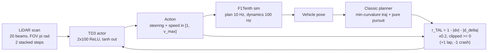

# Evans2023_TAL — High-speed Autonomous Racing using Trajectory-aided Deep Reinforcement Learning

**1. Provenance & Objective**
- Citation: B. Evans, H. A. Engelbrecht, H. W. Jordaan (Electrical and Electronic Engineering Department, Stellenbosch University, South Africa). *IEEE Robotics and Automation Letters*, vol. 8, pp. 5353–5359, 2023. DOI: 10.1109/lra.2023.3295252. Ingested copy is the arXiv preprint `arXiv:2306.07003v1 [cs.RO]`, 12 Jun 2023 (`2306.07003v1.pdf`, p. 1 sidebar; author affiliation from the p. 1 footnote). Citation data comes from the verified bibliography entry of the thesis base document; no `.zotero.json` sidecar exists for this file.
- Core Goal: "how to train DRL agents for high-speed racing using only a LiDAR scan as input" (`Sec. I`). The contribution is **trajectory-aided learning (TAL)**: a reward that compares the agent's action with the action a classical planner following the optimal trajectory would have chosen (`Sec. I`, contribution 1; `Sec. III-C`).
- Claimed contributions (`Sec. I`, list 1–3): present TAL; show TAL raises completion rate at high speed over the baseline; show TAL agents pick speed profiles similar to the optimal trajectory and beat related literature.
- Code/data: released and seeded — <https://github.com/BDEvan5/TrajectoryAidedLearning> (`Sec. IV-A`).
- **Relation to this thesis (GOAL v0.2):** Related Literature only. This vault targets *human* sim-racing performance (micro-sector telemetry, ML sector importance, evolutionary lap optimization). This paper is the direct evidence for the base document's claim that racing optimization work is framed as **autonomous control** and therefore gives limited insight into improving human drivers — see §4 below, where the five framing questions are answered with citations. It is a **non-goal** of this thesis to build such an agent (GOAL §3, bullets 1–2).

**2. Methodology Breakdown**
- Problem framing: end-to-end DRL replaces the whole classical localisation → planning → control pipeline with one neural network (`Fig. 2`, `Sec. II`).
- RL algorithm: **TD3** (twin-delayed DDPG), a DDPG-family actor–critic for continuous actions; pair of Q-networks, target-policy smoothing noise, delayed policy updates every second Q-update (`Sec. III-A`, `Eq. 2`).
- State vector: **20 evenly spaced LiDAR beams**, field of view $\pi$ rad, scans from the previous *and* current planning step stacked so the agent can infer speed; each beam scaled by a 10 m maximum to $[0,1]$ (`Sec. III-B`, State Vector).
- Action vector: two continuous actions in $[-1,1]$ → steering angle (scaled by max steering angle) and speed (scaled to $[1, v_\text{max}]$ m/s; 1 m/s floor stops the car standing still) (`Sec. III-B`, Action Vector).
- TAL reward (`Sec. III-C`, `Eq. 3`):
$$r_\text{TAL} = 1 - |v_\text{agent} - v_\text{classic}| - |\delta_\text{agent} - \delta_\text{classic}|$$
  combined with a base reward of $+1$ for lap completion and $-1$ for crashing; the shaped term is **scaled by 0.2 and clipped above 0** (`Sec. III-C`, TAL Reward).
- Classical reference planner: minimum-curvature path with a minimum-time speed profile from Heilmeier et al. [3], tracked by **pure pursuit** [13]; its speed action is the speed of the upcoming waypoint (`Sec. III-C`, Classical Planner).
- Baseline reward for comparison (`Sec. III-D`, `Eq. 4`):
$$r_\text{baseline} = \frac{v_\text{t}}{v_\text{max}}\cos\psi - d_\text{c}$$
  i.e. reward velocity along the track direction, punish cross-track deviation $d_\text{c}$ (centre-line tracking).
- Simulator and vehicle: open-source **F1Tenth** simulator [27]; LiDAR simulated by ray casting with **noise std 0.01** per beam; **planning at 10 Hz, internal dynamics at 100 Hz**; kinematic/single-track bicycle model with 7-dimensional state $(x, y, v, \theta, \dot\theta, \delta, \beta)$ from CommonRoad [28]; the linear slip assumption is "accurate for small slip angles ($\approx< 8^\circ$) but inaccurate for higher slip angles" (`Sec. IV-A`, `Fig. 6`).
- Learning implementation: 2 hidden layers × 100 neurons, ReLU hidden / tanh output; Adam, learning rate 0.001, batch size 100, discount 0.99, exploration noise 0.1, action-smoothing noise 0.2, noise clipping 0.5 (`Sec. IV-A`, Learning Implementation).
- Training/testing protocol: **100,000 simulator steps** per agent; test result = average of **20 test laps**; every learning experiment **repeated 5 times with unique random seeds** (`Sec. IV-A`, Experiments).
- Maps: four tracks — AUT, ESP, GBR, MCO (`Fig. 5`). Reported lengths: ESP 236.8 m, GBR 202.2 m, MCO 178.3 m, AUT 93.7 m (`Sec. IV-C`).

*(flow and parameters from `Sec. III-B`, `Sec. III-C`, `Fig. 3`, `Fig. 4`, `Sec. IV-A`)*

**3. Key Findings & Performance Metrics**

*Experiment 1 — maximum-speed sweep on ESP (`Sec. IV-B`)*

| $v_\text{max}$ | Baseline average training progress | TAL average training progress | Source |
| :--- | :--- | :--- | :--- |
| 4 m/s | "near 100%" | over 75% (all speeds) | `Sec. IV-B` |
| 6 m/s | decreasing with speed (value not stated per speed) | 80% | `Sec. IV-B` |
| 7 m/s | decreasing with speed (value not stated per speed) | 75% | `Sec. IV-B` |
| 8 m/s | "below 25% for the entirety of the training" | 70% | `Sec. IV-B` |

- Completion rate of the **trained** agents on ESP: baseline 100% at 4 m/s, drops to 50% at 6 m/s, and "the 8 m/s agents do not complete any laps"; TAL reaches 60% at 6 m/s and 40% at 8 m/s (`Sec. IV-B`, `Fig. 8`).
- Lap-time trade-off is explicit: "The TAL agent has faster lap times for lower maximum speeds than the baseline. As the maximum speed increases, the times even out and then the baseline achieves faster lap times than the TAL agent." (`Sec. IV-B`). Exact lap times are only shown as bars in `Fig. 8` — not tabulated.

*Experiment 2 — four maps at 6 m/s (`Sec. IV-C`)*
- On ESP, GBR and MCO the **baseline completes under 25%** of laps; **TAL completes over 75%** on all four tracks; the baseline achieves "slightly lower lap times" (`Sec. IV-C`, `Fig. 10`).
- Generalisation: agents trained on GBR, tested on AUT/ESP/GBR/MCO. Lap times of baseline and TAL are "close together"; TAL completion is significantly higher on all tracks, but all completion rates drop versus the training-track case — "while the policies learned do generalise to other tracks, there is a performance drop in the completion rate" (`Sec. IV-C`, `Fig. 11`).
- Episode-reward magnitudes are **not comparable** across formulations: "The baseline reward signal provides larger rewards per episode than the TAL agent due to the scaling used in the calculation." (`Sec. IV-C`, `Fig. 9`).

*Experiment 3 — trajectory and slip analysis at 6 m/s (`Sec. IV-D`)*
- Baseline holds a "near-constant speed of around 6 m/s for most of the trajectory"; the classic planner slows in corners and speeds up on straights; TAL "learns to select a similar speed profile to the classic planner" (`Sec. IV-D`, `Fig. 12`, `Fig. 13`).
- Absolute slip angle: classical smallest; TAL "reaches $10^\circ$"; baseline "regularly exceeding $15^\circ$ and reaching over $30^\circ$" (`Sec. IV-D`, `Fig. 13`). The authors read this as the baseline **exploiting the simulation model** by drifting, and note such policies "are not feasible for physical implementation since in reality tyre dynamics are non-linear" (`Sec. IV-D`). Note the model's own stated validity limit is $\approx< 8^\circ$ slip (`Sec. IV-A`) — so both learned policies operate partly outside it.

*Experiment 4 — 8 m/s comparison (`Sec. IV-E`)*
- TAL "roughly tracks the classical planner through the whole segment, occasionally deviating by selecting higher speeds or changing speed quickly"; admitted limitation: "the DRL agent's actions are less smooth than the classical planner" (`Sec. IV-E`, `Fig. 15`).
- Lap times versus Brunnbauer et al. [23] and Bosello et al. [9] on the four tracks are given only as bars in `Fig. 16`; no numeric table. The stated cause of the win is the higher maximum speed: "The classical and TAL planners use a maximum speed of 8 m/s, showing that a higher maximum speed allows them to complete laps faster than previous methods." (`Sec. IV-E`).
- **Computational cost: not reported in the source.** No CPU/GPU model, no wall-clock training time, no inference latency, no memory figure anywhere in the paper. The only timing-adjacent quantities are the control rates (10 Hz planning, 100 Hz dynamics, `Sec. IV-A`) and the 100,000-step training budget (`Sec. IV-A`).

**4. Critique & Optimization Vectors**

*Framing answers for the base document's claim (autonomous control ≠ human coaching):*

| Question | Answer | Source |
| :--- | :--- | :--- |
| Autonomous agent or human driver? | **Autonomous agent only.** A TD3 neural network maps raw LiDAR to steering and speed commands; no human is in the loop, modelled, or measured anywhere in the paper. | `Sec. I`; `Sec. III-B`; `Fig. 3` |
| What is optimized? | A **reward signal**, not a lap time directly: $r_\text{TAL}$ penalises the deviation of the agent's (speed, steering) action from a classical planner's action. The optimisation variables are neural-network weights. | `Sec. III-C`, `Eq. 3` |
| Is the output human-actionable advice? | **No.** The deliverable is a trained policy (network weights) plus aggregate plots of speed, slip angle and completion rate. The only human-readable prescriptions are the two qualitative statements "slowing down in the corners and speeding up in the straights" (`Sec. V`) and "smaller slip angles" (`Sec. V`) — generic racecraft, with no per-corner target speed, brake point, or driver-facing metric. | `Sec. V`; `Fig. 13`, `Fig. 15` |
| Track segmentation? | **No sectors, no corners as objects.** The track is treated as a continuous "track progress (%)" axis; results are per *map*, and figures show "a portion of the ESP track". There is no micro-sector, sector, or corner index anywhere. Segment-level granularity: **not reported in the source**. | `Fig. 13`, `Fig. 15`, `Sec. IV-D`–`IV-E` |
| Corner interdependency / speed trade-off between sequential corners? | **Not addressed.** The only trade-off analysed is the global one between maximum speed and completion rate (`Sec. IV-B`), and the aggregate lap-time-versus-completion trade-off (`Sec. IV-C`). No effect of one corner on the next is measured or claimed. | `Sec. IV-B`, `Sec. IV-C`; interdependency not reported in the source |
| Data scale and hardware? | Scale: 100,000 training steps per agent, 20 test laps per evaluation, 5 seeds per configuration, 4 maps, 5 maximum-speed settings. **Hardware: not reported in the source** (no CPU, GPU, RAM, or runtime figure in the paper). | `Sec. IV-A`; hardware not reported in the source |

*Blind spots (AGENTS.md §4 checklist):*
- **Simulation only.** All results come from the F1Tenth simulator; the paper never runs on a physical car and names this itself: "Future work should study how these improvements to racing performance transfer to actual vehicles. TAL agents are **expected** to transfer better to physical vehicles…" (`Sec. V`). That expectation is untested — an author-admitted gap, and a hardware-implementation bottleneck.
- **Nothing is timed.** No training time, no per-step inference time, no hardware. The whole computational-cost axis that this vault requires (AGENTS.md §2) is absent, so no number here can enter a solve-time comparison with any other paper.
- **Tuned but never swept.** The reward scale **0.2** and the clip-at-zero rule (`Sec. III-C`) are single stated values with no sensitivity study; likewise 20 LiDAR beams, the 10 m range scaling (`Sec. III-B`), and all TD3 hyperparameters (`Sec. IV-A`). Each is an unexplored axis.
- **The comparison is confounded by $v_\text{max}$.** The literature comparison in `Fig. 16` runs TAL and classic at 8 m/s against methods the paper itself describes as using top speeds of 5 m/s (`Sec. II-B`), and then attributes the win to the higher maximum speed (`Sec. IV-E`). That is a different operating point, not a like-for-like algorithm comparison.
- **Bars, not numbers.** Lap times (`Fig. 8`, `Fig. 10`, `Fig. 11`, `Fig. 16`) and completion rates are published only as charts; no table of values exists. Any value taken from them must be marked "(read from chart)". None are quoted numerically in this note for that reason.
- **Model-validity violation is acknowledged for the baseline but not for TAL.** The single-track model is stated accurate only for $\approx< 8^\circ$ slip (`Sec. IV-A`), yet the TAL agent "reaches $10^\circ$" (`Sec. IV-D`). The paper criticises the baseline's $>30^\circ$ drifting as simulator exploitation but does not discuss TAL's own excursion past the model's stated validity bound.
- **TAL is bounded by its teacher.** The reward is a distance to the classical planner's action (`Eq. 3`), so the method can at best imitate the minimum-curvature / minimum-time trajectory; it cannot discover a faster line. The paper does not claim otherwise, but this makes "optimization" here a *tracking* objective, not a lap-time search.
- **Thesis-side takeaway.** Evidence for GOAL §0's literature position: racing optimisation in F1TENTH is posed as autonomous control with a neural policy as the artefact, evaluated by completion rate and aggregate lap time over a whole track. It contains no sector decomposition, no human telemetry, and no interpretable per-segment advice — exactly the gap this thesis targets with micro-sector importance (G2) and a coaching read-out (G4.4). The two works share no comparable metric: DRL completion rate in a simulator versus human lap classification from telemetry, on different hardware and different scenarios (AGENTS.md §1, no cross-paper metric merging).
