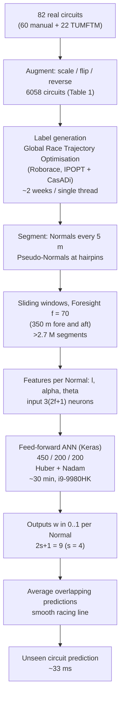

# Garlick2021_MLTrajectory — Real-time optimal trajectory planning for autonomous vehicles and lap time simulation using machine learning

**1. Provenance & Objective**
- Citation: S. Garlick (Department of Computer Science, The University of Manchester, UK) and A. Bradley (Autonomous Driving & Intelligent Transport Group, School of Engineering, Computing & Mathematics, Oxford Brookes University, UK). *Vehicle System Dynamics*, vol. 60, no. 12, pp. 4269–4289. DOI: 10.1080/00423114.2021.2011929. Open Access (CC BY 4.0). (`p. 4269`, header and affiliation block)
- **Year discrepancy — flagged per AGENTS.md §1.** The thesis base document's bibliography records **2021**. The PDF cover page reads "Published online: 17 Dec 2021" and "© 2021 The Author(s)", while the publisher's own citation line on the same page reads "S. Garlick & A. Bradley (2022) …, Vehicle System Dynamics, 60:12, 4269-4289" and the running header of the article body reads "2022, VOL. 60, NO. 12". Article history: "Received 18 March 2021, Revised 11 November 2021, Accepted 21 November 2021" (`p. 4269`). This note keeps **2021** (online publication and copyright year, matching the base document). The 2022 issue year is the print-issue assignment. No number in this note depends on the choice.
- Core goal: predict the ideal racing line for a *previously-unseen* circuit in real time with a feed-forward ANN, trained on racing lines generated by a traditional optimal-control lap-time simulator, so the target path can be produced "several orders of magnitude" faster than by solving the optimal control problem. (`Abstract`; `Sec. 1`, final paragraph)
- Code/data: no code released by the authors. The training-label generator is third-party and public — the *Global Race Trajectory Optimisation* tool of Christ et al., TUMFTM (`Sec. 2.1`, ref. [46]); track boundaries partly from the TUMFTM Racetrack-Database (`Sec. 2.1`, ref. [45]). Network implemented in *Keras* (`Sec. 2.4`, ref. [51]).
- **Relation to this thesis (GOAL v0.2).** This is a **Related Literature** item, not a build target. It is the strongest single piece of evidence for the base document's claim that racing-line generation is framed as an *autonomous control* problem with limited insight for improving *human* performance: the paper's stated purpose is on-board AV trajectory planning and LTS pre-calculation (`Sec. 1`; `Sec. 4`), the subject vehicle is the driverless *Roborace* car (`Sec. 2.1`), and no human telemetry enters the pipeline at any stage. It is simultaneously the closest prior art to G3 on *ML-generated racing lines*, so its racing-line representation (§4 below) is read here as a candidate search-space encoding for our evolutionary optimizer — with the explicit caveat that the paper produces a **path only, no speed trace** (`Sec. 5`: "many other solutions simultaneously generate a speed trace – which is currently beyond the scope of the method presented in this paper"), which is precisely the quantity G2/G4 need.

---

**2. Methodology Breakdown**

**2.1 Training data generation** (`Sec. 2.1`)
- Track boundaries (inner and outer) were reconstructed for **82 real circuits** from around the world, including several Formula 1 calendar tracks — **60 manually generated**, **22 taken directly from TUMFTM** (`Sec. 2.1`).
- Augmentation (scaling, flipping, reversing direction of travel) expanded these to **6058 circuits** total. Split per `Table 1`:

| Subset | Real | Augmented | Total | Source |
| :--- | ---: | ---: | ---: | :--- |
| Training | 66 | 5168 | 5234 | `Table 1` |
| Validation | 7 | 529 | 536 | `Table 1` |
| Testing (unseen) | 9 | 279 | 288 | `Table 1` |
| **Total** | **82** | **5976** | **6058** | `Table 1` |

- The proportions in prose: training uses "the majority (86%) of the dataset", tuning a "further 9%", final evaluation "the remaining 5%" (`Sec. 2`, overview).
- Labels (the optimal racing line per circuit) came from the **Global Race Trajectory Optimisation** tool [46] by Christ et al. [32], run with **default solver settings and vehicle parameters for the *Roborace* vehicle**: a double-track model with QSS weight transfer and non-linear tyre models, transcribed to an NLP by **Gauss–Legendre collocation**, solved with **IPOPT**, accelerated by a curvilinear abscissa track description and *CasADi* (`Sec. 2.1`).
- **Label-generation cost:** "The time-consuming process of solving over 6000 optimal laps would have taken approximately **two weeks on a single processor thread** – however, to expedite the task the workload was split across multiple PCs with multi-core processors." The number and specification of those PCs is **not reported in the source** (`Sec. 2.1`).
- All optimal trajectories were computed assuming a **vehicle width of zero** — the vehicle centre may use the full track width — so vehicle width is removed from the training data and re-applied at prediction time, allowing width to be adjusted after training (`Sec. 2.1`).
- The *total dataset size needed* for accurate prediction "was established experimentally, based upon a similar methodology to Roh et al. [47]" — the experiment itself is not shown (`Sec. 2.1`).

**2.2 Circuit segmentation — Normals and sliding windows** (`Sec. 2.2`)
- Each circuit is cut by a series of lines (**"Normals"**) perpendicular to the track centreline, at a **fixed interval of five metres**. The paper notes it is common practice [26,48] to vary spacing to reduce resolution on straights, but keeps the interval constant deliberately: it "eliminates an additional variable, thus reducing dimensionality of the input" (`Sec. 2.2`).
- Where two or more Normals intersect (e.g. a tight hairpin), the offending lines are tilted away from 90° to the centreline until they no longer intersect, becoming **"Pseudo-Normals"**; the deviation angle is encoded as an input feature (`Sec. 2.2`, `Fig. 1a–b`).
- The **waypoint** is the point at which the racing line crosses a Normal (`Sec. 2.2`, `Fig. 1c`).
- Windows: the circuit is described as a series of **overlapping windows**, each containing a fixed number of Normals. For **Foresight** $f$, the window $t_i$ is the ordered set of Normals $N_i(N_{i-f}, \dots, N_i, \dots, N_{i+f})$, i.e. **bidirectional** — $f$ Normals fore *and* aft of the central Normal. The network $g$ is trained so that $g(t_i) \rightarrow w_i$, where $w_i$ is the waypoint location on Normal $N_i$ (`Sec. 2.2`).
- Stated rationale for windowing: fixed network input size ⇒ any circuit length is handled ("Nordschleife (20.8 km) and Brands Hatch GP (2.9 km)"); generalisation of track sections across circuits; and a large increase in samples per circuit, "thereby reducing the number of circuits required in the training dataset" (`Sec. 2.2`).
- Result of segmentation: the dataset contains **over 2.7 million individual segments** of different racetracks, each with its optimal racing line (`Sec. 2`, overview; `Sec. 2.1`; `Sec. 5`).

**2.3 Feature extraction — how geometry and line are encoded** (`Sec. 2.3`)
- The paper rejects the usual curvature-profile representation because "the radius of curvature varies in a highly nonlinear manner, reducing to a few metres at hairpins, and tending towards infinity on straights". Instead the circuit is represented "by variations between the Normal lines describing the structure of the circuit, rather than the curvature" (`Sec. 2.3`).
- **Three geometry features per Normal** (`Sec. 2.3`, `Fig. 2` left):
  - $l_i$ — length of the Normal (i.e. local track width);
  - $\alpha_i$ — angular change between consecutive Normals;
  - $\theta_i$ — angle between the Normal and the true normal to the centreline (90° except for adjusted Pseudo-Normals).
  The **sign of each angle is preserved**, which encodes left- versus right-hand bends (`Sec. 2.3`).
- **Racing-line representation (the output space):** the line is described by a single scalar per Normal, $w$, "ranging between zero and one representing the left and right of the Normal respectively" — i.e. a normalised lateral position along the Normal (`Sec. 2.3`, `Fig. 2` right). The racing line for a lap is therefore the ordered vector of $w$ values along the 5 m Normal grid. Nothing else (no speed, no curvature, no control input) is part of the representation.

**2.4 Network** (`Sec. 2.4`)
- Feed-forward ANN, chosen because the problem is a regression task [50] and for "the minimal computation time required by this type of network in generating a prediction"; implemented in **Keras** (`Sec. 2.4`).
- **Four fully connected layers**; **Huber loss** [52]; **Nadam** optimiser [53]. Hidden-unit counts chosen by **grid search**: **450 / 200 / 200** on the first, second and third hidden layers (`Sec. 2.4.1`, `Fig. 3`).
- Input layer: $3(2f+1)$ neurons; output layer: $2s+1$ neurons (`Fig. 3`).
- Activations: **sigmoid** on hidden layers, **hard sigmoid** [54] on the output layer, found best by experiment (`Sec. 2.4.1`; `Sec. 5`).
- **Training time: approximately 30 min on a 2.4 GHz Intel Core i9-9980HK processor** (`Sec. 2.4.1`). No GPU used — the paper's `Note 1` says "The ANN is ideally suited to GPU/TPU processing – thus performance could be further expedited on compatible hardware." Batch size, epoch count, and learning rate are **not reported in the source**.
- Hyperparameter tuning used **K-Fold** cross-validation [44] on the 9% validation portion (`Sec. 2`, overview; `Fig. 4` error bars "denote the variance through the different K-Folds"). The value of K is **not reported in the source**.

**2.4.2 Foresight sweep** (`Sec. 2.4.2`, `Fig. 4`)
- Foresight is the single parameter the paper actually sweeps. Larger Foresight improves visibility of surrounding geometry but increases input size and "problem complexity" [55].
- Stated design rule: "the Foresight should be sufficient to cover the length of the longest straight in the dataset" — otherwise on a straight the network "has no concept of whether the previous and upcoming bends are left or right-handed" and the prediction collapses towards the centreline (`Sec. 2.4.2`).
- Chosen value: **70 waypoints, i.e. 350 m fore and aft** of the central Normal (`Sec. 2.4.2`).
- Swept RMS error over Foresight level (validation subset, `Fig. 4`, values printed on the chart): 20 → 0.832 m; 30 → 0.624 m; 40 → 0.551 m; 50 → 0.526 m; 60 → 0.516 m; **70 → 0.514 m (minimum)**; 80 → 0.526 m; 90 → 0.528 m; 100 → 0.535 m; 110 → 0.548 m; 120 → 0.557 m; 130 → 0.561 m; 140 → 0.567 m; 150 → 0.569 m.

**2.4.3 Output sampling** (`Sec. 2.4.3`)
- Rather than predicting every waypoint in a window, the network predicts a small set: sampling level $s$ gives $2s+1$ outputs ($s=0$ ⇒ one output, $s=2$ ⇒ five). Each Normal therefore receives $2s+1$ predictions from neighbouring windows, which are **averaged** — a moving-average smoother producing a smooth line (`Sec. 2.4.3`).
- Chosen: **$s = 4$ (nine network outputs)**, highest accuracy on the validation data, and it removes the need for "computationally expensive filtering techniques of the nature employed by Heilmeier et al. [25]" (`Sec. 2.4.3`, `Fig. 5`).

*(all counts, parameters and timings from `Table 1`, `Sec. 2.1`, `Sec. 2.2`, `Sec. 2.3`, `Sec. 2.4.1`–`2.4.3`, `Sec. 3.2`)*

---

**3. Key Findings & Performance Metrics**

**3.1 Accuracy on the nine unseen real circuits** (`Table 2`) — ANN prediction vs. the OCP-generated line, with solution times:

| Circuit | RMSE (m) | MAE (m) | Apex Error (m) | OCP (s) | ANN (s) |
| :--- | ---: | ---: | ---: | ---: | ---: |
| Hungaroring | 0.331 | 0.255 | 0.112 | 117 | 0.0293 |
| Nürburgring GP | 0.354 | 0.266 | 0.160 | 554 | 0.0314 |
| Nordschleife | 0.470 | 0.336 | 0.127 | 2670 | 0.0550 |
| Paul Ricard (1C-V2) | 0.547 | 0.411 | 0.198 | 468 | 0.0314 |
| Red Bull Ring GP | 0.393 | 0.276 | 0.110 | 134 | 0.0288 |
| Spa | 0.358 | 0.256 | 0.089 | 208 | 0.0335 |
| Brands Hatch GP | 0.285 | 0.226 | 0.105 | 244 | 0.0285 |
| Monza | 0.377 | 0.272 | 0.161 | 207 | 0.0327 |
| Catalunya GP | 0.398 | 0.302 | 0.116 | 202 | 0.0293 |
| **Average** | **0.390** | **0.289** | **0.131** | **534** | **0.0333** |

*(`Table 2`. Hardware for both columns: see §3.2 below — the paper quotes the i9-9980HK only for the ANN.)*

**3.2 Accuracy across the full 288-circuit test set** (`Table 3`): RMS **0.376 m**, MAE **0.267 m**, mean error **0.029 m**, apex error **0.111 m**, 50% CI **0.184 m**, 95% CI **0.826 m**.
- Headline in the abstract: "mean absolute error of ±0.27 m, and just ±0.11 m at corner apex" (`Abstract`; `Sec. 3.1`).
- The error distribution "approximates a Laplace distribution", with mean near zero; the authors attribute the symmetry to flipping/reversing each circuit in training, giving equal numbers of left- and right-hand bends (`Sec. 3.1`).
- Human comparison offered by the authors: Brayshaw and Harrison [7] "found that lines taken by four professional racing drivers varied by more than ±1 m" — so the ±0.83 m 95% CI is argued "comparable to a human racing driver's ability to identify and follow the optimal path" (`Sec. 3.1`). **This is a citation to a third paper, not a measurement made here.**
- Other context given in `Sec. 3.1`: prediction errors are smaller than the ±0.31 m MAE change in optimal line from ±10% localised friction variation (Christ et al. [32]) and the ±1 m (95% CI) change from vehicle-design-parameter adjustment [7]; Dal Bianco et al. [49] show ~±0.08 m apex error between direct and indirect methods vs ±0.11 m here; Kapania et al. [18] show "several meters" discrepancy for their rapid two-step algorithm; Andresen et al. [56] map-generation accuracy ±0.39 m vs ±0.29 m RMSE here.

**3.3 Computation time** (`Sec. 3.2`)
- "Typical solution time for generating a racing line for a previously unseen track via the neural network is **33 milliseconds on a 2.4 GHz Intel Core i9-9980HK processor** – over **9000 times faster** than generating the line (for the majority of normal length circuits) via the OCP method." (`Sec. 3.2`)
- Because all windows can be evaluated **simultaneously** while the OCP proceeds iteratively around the circuit, length barely matters: **Nordschleife (20.8 km) takes 50 ms by ANN vs 46 min by OCP** — "approximately **50,000 times faster**" for that circuit (`Sec. 3.2`; consistent with `Table 2`: 0.0550 s vs 2670 s).
- "approximately **800 times faster** than Kapania et al.'s [18] two-step approach – which (to the authors' knowledge) was previously the fastest known method of generating a non-trivial racing line" (`Sec. 3.2`).
- Training cost is reported once (~30 min, i9-9980HK, `Sec. 2.4.1`); label-generation cost once (~2 weeks single-thread for >6000 laps, `Sec. 2.1`).

**3.4 Where the prediction degrades** (`Sec. 3.1`, `Sec. 3.2`)
- Highest accuracy on circuits whose features are common in the training set — Brands Hatch GP and Hungaroring: "constant radius turns at the end of a straight, moderate length straights, and average track width" (`Sec. 3.1`).
- Worst cases are "edge cases": **Paul Ricard** (long straights, double-apex corners of varying radius) and the **20.8 km Nordschleife** (abundance of complex corners, an extremely long straight). In these the predicted line "becomes a more generic approximation biased towards the centre of the dataset" (`Sec. 3.1`).
- Maximum deviations occur "in areas with more complex and unusual features – e.g. the straight with a subtle bend prior to the upcoming corner at Nürburgring GP, and the complex combination of consecutive turns impacting upon each other (Figure 8)" (`Sec. 3.1`).
- Largest sustained deviations occur on straights; the authors dismiss these as low-impact because "a difference in vehicle position during a straight results in minimal impact upon lap time [18,49]" (`Sec. 3.1`).

---

**4. Critique & Optimization Vectors**

**4.1 Direct answers to the thesis's framing questions**

- **Autonomous vehicle or human driver? Any human telemetry?**
  **Autonomous vehicle. No human telemetry is used anywhere.** The title, abstract and `Sec. 1` frame the work as trajectory planning for AVs and autonomous racing; the vehicle model used to generate every training label is the driverless **Roborace** car with the tool's default parameters (`Sec. 2.1`). The only human element is *hypothetical*: "There is no restriction placed upon the method used to generate the optimal line used in the dataset – it could be taken from a detailed, high-order free-trajectory OCP method …, a human in a Driver-in-Loop simulator (in which case it would 'learn' the lines preferred by a particular driver), or any other traditional method" (`Sec. 2.1`), repeated in `Sec. 5`: "if a large number of circuits driven by a human driver in a DIL simulator … were used, the ANN would 'learn to drive like a particular driver (or simulator) in a particular car'". **This was not done in the paper** — it is named as a possibility only. Humans appear a third time only as a *benchmark cited from another paper* (professional-driver line variation >±1 m, ref. [7], `Sec. 3.1`). **This is the direct support for the base document's claim:** the paper's stated applications are on-board AV trajectory planning, LTS target-line calculation, and pre-calculation for OCP simulators (`Sec. 4`, `Sec. 5`) — nothing about diagnosing or coaching a human driver.

- **Racing-line representation and parameterisation (relevant to our EA search space).**
  A racing line is an ordered vector of **one scalar per Normal**: $w \in [0,1]$, the normalised lateral position of the line along that Normal, 0 = left edge, 1 = right edge (`Sec. 2.3`, `Fig. 2`). Normals sit at a **constant 5 m spacing** along the centreline, tilted into "Pseudo-Normals" only where they would intersect at tight hairpins (`Sec. 2.2`, `Fig. 1`). Track geometry is separately encoded per Normal as $(l_i, \alpha_i, \theta_i)$ = Normal length (track width), inter-Normal angular change, and deviation from true-normal; angle **signs are kept** so left/right bends are distinguishable (`Sec. 2.3`). Curvature is deliberately **not** used as the representation because it is numerically ill-behaved (few metres at hairpins, → ∞ on straights) (`Sec. 2.3`). Two consequences for us: (i) this is a clean, fixed-dimension, box-bounded $[0,1]^n$ encoding — directly usable as an EA genome with trivial feasibility bounds (track limits are the bounds by construction); (ii) **it carries no speed**, so it cannot by itself express the speed trade-offs G2 needs. All labels also assume **vehicle width zero** (`Sec. 2.1`), so track limits in the representation are centreline-based, not body-based.

- **Track segmentation into sectors/corners — granularity? Sequential corners?**
  The track is **not** segmented into semantic sectors or named corners. It is segmented **geometrically and uniformly**: Normals every **5 m**, then **overlapping sliding windows** of $2f+1 = 141$ Normals ($f = 70$, i.e. **350 m fore and aft**, total window span 700 m) (`Sec. 2.2`, `Sec. 2.4.2`). Prediction is per-Normal, from that Normal's window. There is no corner detection, no corner entry/apex/exit labelling, and no notion of "sector *i*" versus "sector *i+1*" as discrete units. **Sequential corners are handled only implicitly**, by the window being wide enough to contain them: the paper's stated design rule is that Foresight must cover "the length of the longest straight in the dataset" (`Sec. 2.4.2`), and Foresight is explicitly **bidirectional** because "the racing line at any point on the circuit is influenced by the preceding curvature (thus resulting in the current vehicle position) and the upcoming curvature of the circuit. Therefore, a performance improvement was found by introducing a bidirectional 'Foresight' – both fore and aft of the current position – enabling the network to learn both how the vehicle arrived at the current position, and where the trajectory heads next." (`Sec. 2.2`). Overlapping windows are then averaged at sampling level $s=4$, which smooths across window boundaries (`Sec. 2.4.3`). *Where our micro-sector segmentation (G1.1) must be reproducible and explicitly defined, this paper's equivalent is a hyperparameter (5 m, $f=70$) tuned for prediction error, not a structure with meaning for a driver.*

- **Corner interdependency and speed trade-offs between sequential corners.**
  Interdependency is **acknowledged qualitatively and handled implicitly; it is never measured**. The bidirectional-Foresight passage above is the paper's statement of the phenomenon (`Sec. 2.2`). The `Fig. 4` Foresight sweep is the only quantitative proxy for "how far does influence reach": RMS error falls steeply out to ~50–70 waypoints (0.832 m at 20 → 0.514 m at 70) then rises again to 0.569 m at 150 (`Fig. 4`, values printed on chart) — the rise is attributed to dimensionality, not to the influence vanishing, so **this curve cannot be read as an interdependency range**. The only other mention is diagnostic: maximum prediction deviations occur at "the complex combination of consecutive turns impacting upon each other (Figure 8)" (`Sec. 3.1`) — i.e. sequential-corner interaction is named as the place where the method is *weakest*. **On speed trade-offs between sequential corners: nothing.** The method produces a path with no velocity profile at all — "many other solutions simultaneously generate a speed trace – which is currently beyond the scope of the method presented in this paper" (`Sec. 5`), also flagged in `Sec. 3.1` ("several existing methods calculate the trajectory alongside other data (e.g. velocity trace, accelerations and often vehicle control inputs) – which is currently beyond the scope of this study"). **There is therefore no corner-interdependency metric and no speed trade-off analysis in this paper.** This is the open space our G2 occupies.

- **Data scale, training time, inference time, hardware.**

| Quantity | Value | Source |
| :--- | :--- | :--- |
| Real circuits | 82 (60 manual + 22 TUMFTM) | `Sec. 2.1` |
| Circuits after augmentation | 6058 (train 5234 / val 536 / test 288) | `Table 1` |
| Training window segments | > 2.7 million | `Sec. 2`, `Sec. 2.1`, `Sec. 5` |
| Normal spacing | 5 m, constant | `Sec. 2.2` |
| Foresight | 70 waypoints = 350 m fore and aft | `Sec. 2.4.2` |
| Sampling level | $s = 4$ (9 outputs) | `Sec. 2.4.3` |
| Network | 4 FC layers, 450/200/200 hidden, Huber + Nadam, sigmoid / hard sigmoid | `Sec. 2.4.1`, `Fig. 3` |
| Label generation | ~2 weeks on a single processor thread for >6000 laps (actually run split across "multiple PCs with multi-core processors", unspecified) | `Sec. 2.1` |
| Training time | ~30 min on 2.4 GHz Intel Core i9-9980HK | `Sec. 2.4.1` |
| Inference time | ~33 ms typical; 28.5–55.0 ms across the 9 test circuits; 50 ms for Nordschleife | `Sec. 3.2`, `Table 2` |
| Inference hardware | 2.4 GHz Intel Core i9-9980HK (CPU; no GPU used) | `Sec. 3.2`, `Note 1` |
| OCP baseline hardware | **not reported in the source** — `Table 2` gives OCP times 117–2670 s but names no machine | `Table 2`, `Sec. 3.2` |
| Epochs / batch size / learning rate / K in K-Fold | **not reported in the source** | `Sec. 2.4` |
| Lap times of the generated lines | **not reported in the source** — accuracy is positional only | whole paper |

**4.2 Blind spots (AGENTS.md §4 checklist)**

- **Simulation only, and not even a closed loop.** Nothing is driven. The output is a geometric path compared against another geometric path; no vehicle follows it, in simulation or on hardware. Despite the title's "Real-time … for autonomous vehicles", no AV, no controller, and no on-board hardware appear anywhere in the results. The abstract's "on-board processing hardware" claim is evidenced by a **desktop/laptop-class i9-9980HK** only (`Sec. 3.2`).
- **The headline speed-up compares against an un-specified machine.** The "over 9000 times faster" and "50,000 times faster" claims divide `Table 2`'s OCP column by its ANN column, but the OCP solve times carry **no hardware specification** (`Table 2`, `Sec. 3.2`). Per AGENTS.md §2 this ratio is not a comparable datum; it is at best an order-of-magnitude indication. The OCP times also embed a specific tool and solver configuration ("default solver settings and vehicle parameters", `Sec. 2.1`) that was never tuned for speed.
- **No lap time is ever computed.** The paper is about lap-time simulation, yet it never reports the lap time of a predicted line versus the lap time of the OCP line. Accuracy is purely positional (RMSE/MAE/apex error, `Table 2`, `Table 3`). The authors instead argue by proxy that apex accuracy is "where it has the most impact upon lap time [27]" and that straight-line deviation matters little [18,49] (`Sec. 3.1`) — both are citations, not measurements made here. **A ±0.27 m mean path error of unknown lap-time cost is the central unmeasured quantity of the paper.**
- **What is tuned but never swept.** Foresight is swept (`Fig. 4`). **Normal spacing (5 m) is not** — it is fixed by an argument about dimensionality, never varied (`Sec. 2.2`). Neither is the sampling level $s$ (chosen as 4, "found to provide the highest accuracy", but no sweep shown, `Sec. 2.4.3`), nor layer depth, nor the augmentation mix. Layer widths came from an unreported grid search (`Sec. 2.4.1`). For our R2 (arbitrary micro-sector granularity), the 5 m spacing here is an unexplored axis in the closest prior art.
- **Third-party label generator = the accuracy ceiling is someone else's tool.** Every training label is whatever TUMFTM's `global_racetrajectory_optimization` with default Roborace parameters produces (`Sec. 2.1`). The ANN can only be as good as that reference, and the paper's own error metrics are all *relative to it*. Ground truth is never independently validated. (The tool is open source, which mitigates opacity, unlike the MoTec i2 Pro issue in [[Hojaji2023_TelemetryML]].)
- **Augmentation dominates the data.** 5976 of 6058 circuits are augmentations of 82 originals (`Table 1`) — a ratio of ~73:1. The authors name this themselves as the cause of the edge-case failures: "diversification should be achieved through the use of a greater selection of original circuits in the training data (rather than the large number of augmentations of a small number of circuits used in this study)" (`Sec. 3.1`, repeated in `Sec. 5`). Real-circuit independence between train and test is claimed ("Care was taken to ensure that an equal proportion of real circuits were in the training and validation data", `Sec. 2.1`), but **flipped/reversed versions of a track are not independent samples**, and whether any augmentation of a *test* circuit reached the training set is not stated.
- **Author-admitted gaps (quoted exactly).** "it does not consider differences in track or weather conditions, or adjustments to vehicle parameters – for which a more extensive dataset including such effects would be required" (`Sec. 4`). "many other solutions simultaneously generate a speed trace – which is currently beyond the scope of the method presented in this paper" (`Sec. 5`). "This approach does not solve the problem *per se*, rather it rapidly generates an accurate prediction to the solution based upon prior training on many solutions to a similar problem" (`Sec. 5`). "the ML approach requires extensive training on existing data" (`Sec. 5`). On the real-time AV application: "Though such a method would require extensive offline pre-training … the parallel nature of the online planning task means that multiple paths could be predicted concurrently" — stated as a future possibility, not built (`Sec. 4`).
- **What scales badly / what scales surprisingly well.** Inference scales almost flat with circuit length because windows evaluate in parallel (2.9 km Brands Hatch 28.5 ms vs 20.8 km Nordschleife 55.0 ms, `Table 2`) — a genuinely strong property. What scales badly is the **offline** side: label generation is ~2 weeks of single-thread OCP for 6000 laps (`Sec. 2.1`), and adding any new dimension the authors name as missing (weather, friction, vehicle parameters, a speed trace) multiplies that dataset. Accuracy also degrades on any circuit unlike the training distribution (`Sec. 3.1`).
- **No statistical treatment of the accuracy claim.** `Table 2` reports one run per circuit. No seed variance, no repeated training runs, no ablation of the architecture. `Fig. 4` is the only place uncertainty appears (K-Fold error bars), and K is unstated.

**4.3 Thesis-side takeaways**

1. **Evidence for the Related Literature claim.** Garlick and Bradley is a clean instance of racing-line generation framed entirely as autonomous control: AV subject vehicle, AV-oriented applications, zero human telemetry, and human drivers present only as a cited accuracy yardstick (`Sec. 1`, `Sec. 2.1`, `Sec. 3.1`, `Sec. 4`). It supports the base document's position without needing to be criticised as bad work — it is a good paper answering a different question.
2. **A reusable genome for G3.** The $w \in [0,1]$-per-Normal encoding (`Sec. 2.3`) is the most economical racing-line parameterisation in the corpus so far: fixed-length, box-bounded, and feasible-by-construction against track limits. If our EA optimizes a *line*, this is the encoding to start from — but it must be extended with a per-sector speed or braking-point variable, because the paper's version carries no speed at all (`Sec. 5`), and G2/G4 are about speed trade-offs.
3. **Their weakness is our target.** The one place their method degrades most is "the complex combination of consecutive turns impacting upon each other" (`Sec. 3.1`) — corner interdependency, unmeasured here, is exactly G2.2.
4. **Not metrically comparable to our work or to [[Hojaji2023_TelemetryML]].** Different subject (AV vs human), different metric (path RMSE vs lap-class accuracy), different hardware. The only figure that could ever cross over is the ~33 ms i9-9980HK inference time, and only as an order-of-magnitude reference for "ML inference is cheap compared with solving an OCP" — not as a benchmark for anything we will build offline.
5. **Reproducibility note for R6-style checks.** No author code released, but the two external dependencies are public (TUMFTM tool [46] and racetrack database [45]) and the network is small and fully specified except for epochs/batch/learning rate (`Sec. 2.4`). A reimplementation is plausible; an exact replication is not, because the 60 manually generated circuits are not published.
