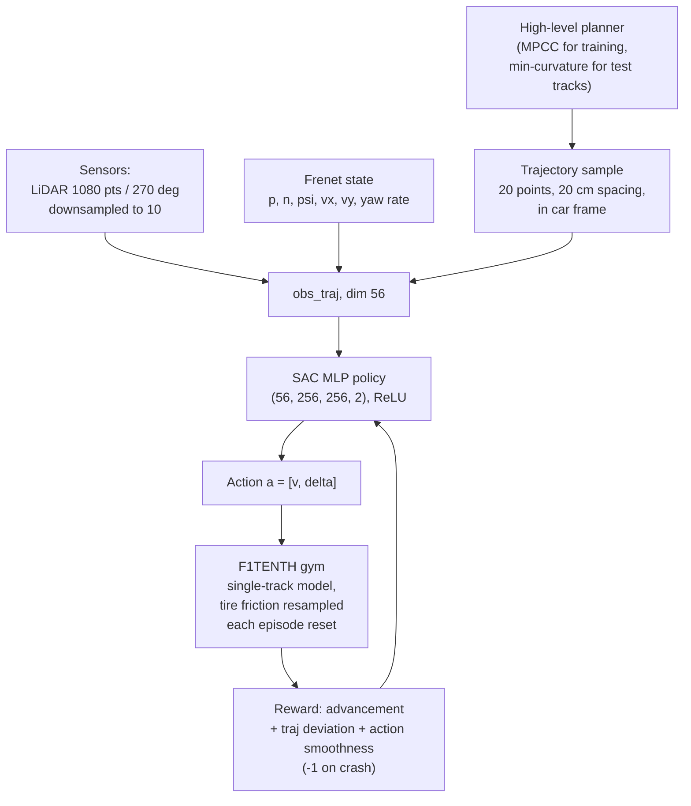

# Ghignone2023_TCDriver — TC-Driver: A Trajectory Conditioned Reinforcement Learning Approach to Zero-Shot Autonomous Racing

**1. Provenance & Objective**
- Citation: E. Ghignone, N. Baumann, M. Magno (ETH Zurich, Switzerland; authors marked as associated with the Center for Project Based Learning, D-ITET). *Field Robotics*, Vol. 3, pp. 637–651, April 2023. Regular Article in the Special Issue "Opportunities and Challenges with Autonomous Racing". DOI: 10.55417/fr.2023020. Received 1 August 2022; revised 15 January 2023; accepted 23 February 2023; published 20 April 2023. (`p. 637`, footer and article header; publisher cite box on `p. 651`)
- Source file: `Vol3_20.pdf` (ETH Research Collection copy; ETH cover page, publication date 2023-04, permanent link 10.3929/ethz-b-000620280). Open access, CC BY 4.0 (`p. 637`, footer).
- **Year conflict — recorded per AGENTS.md §1.** The thesis base document's bibliography cites this work as **2022** ("Ghignone, Baumann, and Magno 2022", `GOAL.md` §0). The PDF itself gives publication date **2023-04** (ETH cover page), DOI `fr.2023020`, and the publisher's own "How to cite this article" box reads *"Ghignone, E., Baumann, N., & Magno, M. (2023)"* (`p. 651`). The vault key therefore uses **2023**. The 2022 date in the base document most plausibly refers to the submission year (received 1 August 2022, `p. 637` footer), but the paper does not say so — this is an inference, not a source claim.
- **Page-range conflict.** The base document's bibliography gives pages 527–536. The PDF running footer gives **3:637–651** on every page. Use 637–651.
- Core goal: train an RL agent that *tracks a trajectory produced by an arbitrary high-level planner*, so the control layer inherits RL's robustness to tire-model mismatch while keeping the planner's reliability — a two-layer planner/controller hybrid for resource-constrained autonomous racing hardware (`Abstract`; `Sec. 1`, "This paper proposes a trajectory-conditioned RL controller (TC-Driver)").
- Code released: <https://github.com/ETH-PBL/TC-Driver> — "The code for reproducing all mentioned RL and MPCC F1TENTH implementations, as well as further result material, is available at …" (`Sec. 4`).
- **Relation to this thesis (GOAL v0.2):** this is a **Related Literature** item only, and it is direct evidence for the base document's framing claim. The thesis (micro-sector telemetry, ML sector importance, evolutionary lap optimization for *human* sim-racing drivers) shares the word "racing" with this paper and nothing else. TC-Driver is an autonomous controller: the subject is a 1:10 robot car, the optimized object is a neural control policy, and the output is a steering/velocity command stream. Nothing in it is advice a human driver could act on, and it never segments a track into sectors. It sits under `GOAL.md` §3 Non-Goals ("Building an autonomous racing agent or a real-time onboard controller"). Its usable value here is (a) as a citation that racing optimization is framed as autonomous control, and (b) as a contrast case for computational cost reporting, which it does well and [[Hojaji2023_TelemetryML]] does not at all.

**2. Methodology Breakdown**
- Simulation environment: F1TENTH OpenAI-Gym environment (O'Kelly et al., 2020b), vehicle dynamics = the *Single Track* (bicycle) model of Althoff et al. (2017), with $\mu$, $C_{S,f}$, $C_{S,r}$ modelling tire friction and front/rear cornering stiffness. The environment was modified to allow noise injection into the simulation parameters. (`Sec. 2.1`; model equations in `Fig. 1`)
- Dynamic state: $s_{dyn} = [s_x, s_y, \psi, v_x, v_y, \dot{\psi}]$. Sensory input: a LiDAR scan of **1080 points over 270°** coverage. Gym observation $obs_{gym} = [scan, s_x, s_y, \psi, v_x, v_y, \dot{\psi}]$. Action $a = [v, \delta]$ — desired longitudinal velocity and steering angle, both continuous. (`Sec. 2.1`)
- Reward (`Eq. 1`): $r_t = -c$ if crashing, otherwise $\Delta\theta_t + p^{traj}\delta_t^{traj} + p^{act}\delta_t^{act}$, with $c = 1$, $\Delta\theta_t$ = track advancement at step $t$, $\delta_t^{traj}$ = distance to the optimal trajectory, $\delta_t^{act}$ = 2-norm of the difference between consecutive action vectors. Scaling parameters **heuristically** set: $p^{traj} = 0.05$, $p^{act} = 0.01$, chosen by "validating a coarse choice of logarithmically spaced parameters and choosing the one that yielded the highest average advancement after a fixed training time". (`Sec. 2.1`)
- RL algorithm: Soft Actor Critic (Haarnoja et al., 2018) via Stable Baselines 3, $\gamma = 0.99$, episode length 10000, batch size 64, train frequency 1, MLP policy. Both agents (baseline and TC-Driver) use the same setup. (`Sec. 2.2`)
- **End-to-end baseline:** observation recast into a Frenet frame, $obs_{Frenet} = [p, n, \psi, v_x, v_y, \dot{\psi}]$ (progress along path, perpendicular deviation, relative heading, longitudinal velocity, lateral velocity, yaw rate). LiDAR downsampled by taking every 108th beam → $scan_{filtered}$, a 10-element array. $obs_{end2end} = [scan_{filtered}, obs_{Frenet}]$, total dimension **16**. Policy = 4-layer MLP, layer sizes **(16, 256, 256, 2)**, ReLU after the second and third layers. (`Sec. 2.2.1`; `Fig. 4` top)
- **TC-Driver (the contribution):** identical to the baseline except the observation is augmented with a *sample of the reference trajectory*. **This is the "trajectory conditioning" mechanism:** 20 points of the optimal trajectory, spaced **20 cm** apart, rotated and translated into the car's own frame of reference. $obs_{traj} = [traj, obs_{end2end}]$, total dimension **56**. Policy = 4-layer MLP, **(56, 256, 256, 2)**, ReLU after the second and third layers — "The only point of difference between the architectures is the size of the input layer." (`Sec. 2.2.2`; `Fig. 4` caption and bottom)
- Source of the conditioning trajectory: during **training**, a pre-generated Model Predictive Contouring Controller (MPCC) trajectory following Liniger et al. (2014) — the track is first traversed by an MPC and the logged trajectory is reused as the optimal tracking target. On the **unseen test tracks** and on the **physical car**, the trajectory instead comes from the minimum-curvature optimizer of Heilmeier et al. (2020), explicitly to show conditioning on arbitrary trajectories. The authors note the trajectory "could be chosen arbitrarily, for example by using the centerline trajectory instead of the time-optimal MPC trajectory". (`Sec. 2.2.2`; `Sec. 3.2`; `Sec. 3.4`)
- Tire parameter randomization (domain randomization): Gaussian noise applied to tire coefficients at **each environment reset**, centered on the nominal friction used by the MPC. The standard deviation was set to **half** of the friction limit at which MPC could no longer complete a lap. Numerically, $\mu_{noisy} \sim \mathcal{N}(1.0489, 0.0375)$. (`Sec. 2.3`)
- Training budget: **every agent was trained for $5 \times 10^5$ time steps** on training track $F$. (`Sec. 3`, paragraph under `Fig. 5`)
- Tracks: training on $F$; testing on *Autodrome*, *Catalunya*, *Oschersleben*, unseen during training, from the open-source repository of Heilmeier et al. (2020). "The tracks vary in length from 89 to 470 m." (`Fig. 2` caption; `Sec. 3.2`)

*(structure from `Sec. 2.1`, `Sec. 2.2.2`, `Sec. 2.3`, `Fig. 3`, `Fig. 4`; reward from `Eq. 1`)*

**3. Key Findings & Performance Metrics**

Robustness to tire modelling mismatch — 200 runs on training track $F$, test friction drawn from a distribution with mean **0.2 lower** than nominal and the same std (0.0375), i.e. mostly outside the training range; MPC run with the nominal, wrong model (`Sec. 3.1`):

| Method | Lap time $t_\mu$ [s] | Lap time $t_\sigma$ [s] | Crashes | Advancement $adv_\mu$ [%] | $adv_\sigma$ [%] | Source |
| :--- | :--- | :--- | :--- | :--- | :--- | :--- |
| MPC | 10.094 | 0.501 | 80.50 % | 32.67 | 28.26 | `Table 2` |
| End-to-end | 11.148 | 0.302 | 73.50 % | 52.51 | 28.69 | `Table 2` |
| **TC-Driver** | 10.798 | **0.143** | **2.50 %** | **99.37** | **4.90** | `Table 2` |

- Crash-ratio improvement: factor of ~32 over MPC and ~29 over end-to-end, at the cost of being "only ~7 % slower" than MPC (10.798 s vs 10.094 s). Only completed laps count toward $t_\mu$. (`Sec. 3.1`; `Table 2` caption)

Track generalization — 200 runs per track, agents started at 200 different positions, **no** tire randomization (zero model mismatch, so MPC is in its optimal regime and shown "for reference" in gray):

| Track | Method | $t_\mu$ [s] | $t_\sigma$ [s] | Crashes | $adv_\mu$ [%] | $adv_\sigma$ [%] |
| :--- | :--- | :--- | :--- | :--- | :--- | :--- |
| Autodrome | MPC | 46.461 | 0.029 | 0.00 % | 100.00 | 0.00 |
| Autodrome | End-to-end | 52.557 | 0.234 | 96.00 % | 35.09 | 27.06 |
| Autodrome | TC-Driver | 59.020 | 0.307 | 8.00 % | 95.32 | 17.88 |
| Catalunya | MPC | 41.475 | 0.036 | 0.00 % | 100.00 | 0.00 |
| Catalunya | End-to-end | 46.878 | 0.207 | 95.50 % | 44.16 | 30.33 |
| Catalunya | TC-Driver | 52.978 | 0.321 | 59.50 % | 65.27 | 37.03 |
| Oschersleben | MPC | 25.915 | 0.022 | 0.00 % | 100.00 | 0.00 |
| Oschersleben | End-to-end | n.a. | n.a. | 100.00 % | 19.27 | 19.93 |
| Oschersleben | TC-Driver | 34.603 | 0.415 | 94.00 % | 46.95 | 31.23 |

*(all values `Table 3`)*

- Reading of the above by the authors: the end-to-end agent "never manag[es] to complete more than 5 % of the laps", and never completes a lap on Oschersleben; TC-Driver completes "more than 40 % of the laps on *Catalunya*" and only 6 % on *Oschersleben*. (`Sec. 3.2`) — note the `Table 3` crash figures (59.50 % and 94.00 %) are the complements of those completion rates.
- Named failure mode, the paper's only corner-level observation: *Oschersleben* contains a **high-speed chicane** ("a fast left and subsequent right turn (or vice versa)") absent from training track $F$; "TC-Driver also occasionally fails at driving in this situation". (`Sec. 3.2`, final paragraph / `p. 647`)

Computational time — **Intel i7-10700K CPU** (`Sec. 3.3`):

| Method | Computation time $t_\mu$ [ms] | $t_\sigma$ [ms] | Source |
| :--- | :--- | :--- | :--- |
| MPC | 11.2 | 0.9 | `Table 4` |
| End-to-end | 0.26 | 0.05 | `Table 4` |
| TC-Driver | **0.27** | **0.04** | `Table 4` |

- Interpretation: RL inference is "faster by a factor of roughly 40" than the MPC solve; the MPC's higher std is attributed to "the nature of quadratic programming, which is subject to constantly varying solving conditions". (`Sec. 3.3`). In `Sec. 1` the authors quote the same result as "an average duration of 0.25 ms compared to the average MPC solving time of 11.5 ms" — **this differs from `Table 4` (0.27 / 11.2 ms)**; the table values are used here.
- The larger 56-dim input of TC-Driver costs +0.01 ms of inference over the 16-dim end-to-end policy (`Table 4`) — i.e. trajectory conditioning is effectively free at runtime.

Sim2Real — physical 1:10 F1TENTH car, 10 clockwise + 10 counterclockwise runs on an unseen real track, agents deployed with **no model refinement** after simulation training (`Sec. 3.4.1`):

| Method | $t_\mu$ [s] | $t_\sigma$ [s] | Crashes | Source |
| :--- | :--- | :--- | :--- | :--- |
| End-to-end | n.a. | n.a. | 100.0 % | `Table 5` |
| TC-Driver | 20.281 | 0.373 | 10.0 % | `Table 5` |

- Physical platform: Traxxas 4x4 Slash chassis, VESC 6 MkIV ESC (with its integrated IMU), Hokuyo UST-10LX laser scanner, onboard computer **NUC10i3FNKNI3-10110U** running Ubuntu 20.04 and ROS Noetic. State estimator = 2D LiDAR SLAM (Hess et al., 2016) for position + EKF (Moore and Stouch, 2014) for velocity, dynamic state per Polack et al. (2017) and Althoff et al. (2017). Onboard trajectory planner = minimum curvature (Heilmeier et al., 2020). (`Sec. 3.4`; `Fig. 7`)
- Stated deployment target hardware in the introduction: "resource-constrained hardware such as an Intel Core i3-1115G4 CPU or an NVIDIA Jetson NX". (`Sec. 1`)
- Consistency claim: the real-car $t_\sigma \approx 0.373$ s and 10 % crash ratio are close to the simulated values, "indicating a deterministic behavior". (`Sec. 3.4.1`)

**4. Critique & Optimization Vectors**

Answers to the thesis-specific questions (GOAL v0.2 framing), each with a location:

- **Autonomous agent or human driver?** Purely an **autonomous agent**. The subject is an RL control policy driving a simulated and then a physical 1:10 F1TENTH robot car (`Abstract`; `Sec. 3.4`). No human driver appears anywhere in the paper. There is no human baseline, no human telemetry, no driver study. Human performance is mentioned only once and only about *other* work (Fuchs et al. 2021 and Wurman et al. 2022 "apply RL to outperform professional human drivers in the setting of a highly realistic videogame", `Sec. 1`). This paper is direct support for the base document's claim that racing optimization work is framed as autonomous control.
- **What is optimized, and is the output human-actionable advice?** Optimized: the weights of a 4-layer MLP policy, against the reward of `Eq. 1` (track advancement, minus deviation from the reference trajectory, minus action-to-action change), via SAC over $5\times10^5$ environment steps (`Sec. 2.1`, `Sec. 2.2`, `Sec. 3`). The output is a per-timestep continuous action $a = [v, \delta]$ — a desired velocity and steering angle sent to the actuators (`Sec. 2.1`; `Sec. 3.4`). **Not interpretable as coaching advice.** The policy is a black-box MLP; the paper reports no feature importance, no attribution, no explanation of *why* the agent does what it does, and the only qualitative read-out is trajectory overlay plots (`Fig. 5`, `Fig. 6`, `Fig. 8`). The authors even name an anti-coaching artefact: the learned behaviour has "bang-bang control characteristics that are in the nature of the RL architecture" (`Sec. 4`) — a control signature no human could or should reproduce.
- **How is the reference trajectory represented and fed to the policy?** As a raw geometric sample appended to the observation vector: **20 points, 20 cm apart, rotated and translated into the car's own frame**, giving 40 of the 56 observation dimensions; $obs_{traj} = [traj, obs_{end2end}]$ (`Sec. 2.2.2`). It carries geometry only — the paper does not state that any target *speed* profile is included in the sampled points. The trajectory source is swappable (MPCC during training, minimum-curvature optimizer at test time and on hardware) and the authors state it "could be chosen arbitrarily, for example by using the centerline trajectory" (`Sec. 2.2.2`; `Sec. 3.2`).
- **Sector or corner segmentation?** **None.** The track is never partitioned into sectors, micro-sectors, or corner segments. The spatial representation is continuous: Frenet progress $p$ along the path and the rolling 20-point / 4-metre trajectory window (`Sec. 2.2.1`, `Sec. 2.2.2`). All results are reported **per lap** (lap time, crash ratio, lap advancement — `Tables 2–5`). The finest spatial granularity anywhere in the paper is the qualitative identification of a single track feature, the *Oschersleben* high-speed chicane, as the place where TC-Driver fails (`Sec. 3.2` end / `p. 647`), and the chicane figure panels of `Fig. 5` and `Fig. 6`.
- **Corner interdependency or speed trade-off between sequential corners?** **Not addressed — not reported in the source.** There is no analysis of how one corner conditions the next. The one structurally adjacent idea is that MPC's optimality comes from "the receding horizon" (`Sec. 3.2`), and that the agent sees only a 4 m look-ahead window of trajectory (`Sec. 2.2.2`) — but the paper draws no conclusion about sequential-corner trade-offs from either. Thesis consequence: this paper offers **no** baseline, measure, or effect size for `GOAL.md` G2.2.
- **Data scale, training time, inference time, hardware.**
  - Data scale: no dataset — data is generated online. Training budget $5\times10^5$ environment time steps per agent, one training track, episode length 10000 (`Sec. 3`; `Sec. 2.2`). Evaluation scale: 200 runs per configuration in simulation (`Tables 2`, `3`), 10 + 10 runs on hardware (`Table 5`).
  - **Training wall-clock time: not reported in the source.** Training hardware is also not reported; the only stated machine is the i7-10700K used for the *inference/solve* timing (`Sec. 3.3`), and it is not said to be the training machine.
  - Inference time: **0.27 ms mean, 0.04 ms std, Intel i7-10700K** (`Table 4`, `Sec. 3.3`).
  - Deployment hardware: NUC10i3FNKNI3-10110U onboard the F1TENTH car (`Sec. 3.4`); the introduction names an i3-1115G4 or Jetson NX as the class of target (`Sec. 1`).

Blind spots (AGENTS.md §4 checklist):

- **Hardware validation is partial, and only for one agent.** The Sim2Real experiment is 20 runs on a single unseen real track (`Table 5`) — no real-world tire-mismatch experiment, and the end-to-end baseline crashes 100 % of the time, so the "10-fold" crash-ratio claim (`Abstract`, `Sec. 1`) rests on a comparison where the baseline produces no lap time at all (`Table 5`, both $t_\mu$ and $t_\sigma$ are `n.a.`).
- **What is not timed.** Only controller inference / MPC solve are timed (`Table 4`). **Untimed:** training, the MPCC and minimum-curvature trajectory generation that TC-Driver depends on, the onboard SLAM + EKF state estimator, and the ROS wrapper that feeds the policy (`Sec. 3.4`). The headline "~40× faster than MPC" therefore compares the *controller only* and silently excludes the offline planner TC-Driver requires but the end-to-end agent does not. The paper never states the total onboard cycle time.
- **Tuned but never swept.** The reward scalings $p^{traj} = 0.05$ and $p^{act} = 0.01$ are "heuristically" chosen with a single coarse logarithmic search reported as a sentence, with no table and no sensitivity result (`Sec. 2.1`). The trajectory sample geometry — **20 points at 20 cm**, i.e. a 4 m look-ahead — is stated once and never varied (`Sec. 2.2.2`), even though it is the paper's entire contribution and the obvious knob for the chicane failure. The randomization std (half the MPC failure limit, `Sec. 2.3`) is a single value. Training length $5\times10^5$ steps is a single value with no learning curve (`Sec. 3`).
- **Reported at one problem size only.** Every quantitative result is from a 1:10-scale car with a single-track model. `Fig. 2` notes tracks of 89–470 m, but no scaling study exists for full-size vehicles, higher speeds, or longer trajectories.
- **Author-admitted gaps (quoted exactly).** "Future work on this topic regards the alleviation of the bang-bang control characteristics that are in the nature of the RL architecture." (`Sec. 4`); on MPC's poor showing: "this result does not exhibit superiority to the general class of MPC but rather demonstrates a case in which RL can be utilized in the mitigation of model mismatch" (`Sec. 3.1`), with the mismatch "purposely chosen to make it fail" (`Sec. 3.1`); "TC-Driver also occasionally fails at driving in this situation" (high-speed chicane, `Sec. 3.2`).
- **The MPC comparison is stacked by construction.** In `Table 2` the MPC runs on the nominal model while the tires are outside the training range (`Sec. 3.1`); in `Table 3`, with no mismatch, MPC wins every track on lap time, std, and crash ratio (0.00 % everywhere) and TC-Driver is 12–34 % slower. The robustness claim is real but scenario-specific, and the authors say so.
- **No seed variance on training.** All results are 200 *evaluation* runs of what appears to be one trained agent per architecture; the number of training seeds is not reported in the source. Crash-ratio differences across tracks (8 % → 94 %, `Table 3`) therefore carry no training-variance bar.
- **Thesis-side takeaway.** Nothing here is metrically comparable to this thesis's work. The subject (robot vs human), the object of optimization (policy weights vs lap-strategy / sector targets), the data (online simulator rollouts vs recorded human telemetry), the granularity (whole lap vs micro-sector), and the hardware are all disjoint. Its two legitimate uses: (1) a citation for "racing optimization is framed as autonomous control with limited insight for improving human performance" (`GOAL.md` §0); (2) a positive example of the cost reporting `GOAL.md` G3.4 demands — hardware named, mean and std given, problem size stated (`Table 4`, `Sec. 3.3`) — which is exactly what [[Hojaji2023_TelemetryML]] omits.
