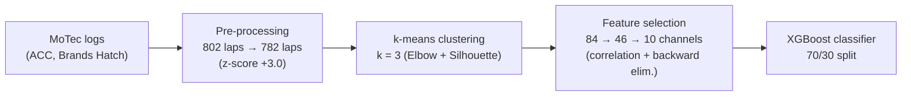

# Hojaji2023_TelemetryML — A Machine Learning Approach for Modeling and Analyzing of Driver Performance in Simulated Racing

**1. Provenance & Objective**
- Citation: F. Hojaji, A. J. Toth, M. J. Campbell (Esports Science Research Lab, Lero, University of Limerick). In L. Longo, R. O'Reilly (Eds.), *AICS 2022*, CCIS 1662, pp. 95–105, Springer, 2023. DOI: 10.1007/978-3-031-26438-2_8. `Hojaji2023_TelemetryML.pdf` (venue from the chapter's copyright footer, p. 95; sidecar has no venue field)
- Core Goal: Classify *human* sim-racing laps into performance levels from telemetry, and identify which telemetry channels/features have the most impact on driver performance — claimed as "the first study that applies AI techniques to telemetry data obtained from web data sources" in sim racing. (`Sec. 1`, last paragraph)
- **Relation to this thesis:** no trajectory optimization, no MPC, no solver. Its value here is (a) which telemetry features separate fast from slow laps (candidate cost-function/analysis features), and (b) fast-driver behaviour signatures (early/sharp throttle, late braking) as a qualitative reference for what an optimal racing controller should reproduce. (`Sec. 3.3`)
- Code/data: no code released. Data from public MoTec repositories: ArisDrives MoTec Server (http://motec.ascaroth.de) and 710 GTRL Racing (https://disboard.org/), gathered prior to September 2022. (`Sec. 2.1`, footnote 1)

**2. Methodology Breakdown**
- Domain: Assetto Corsa Competizione (ACC) sim, Brands Hatch track only. Telemetry logged via MoTec i2 Standard (v1.1.2.0473); extracted with MoTec i2 Pro (V1.1.5) into three CSVs per log (sector/lap times, channel statistics, time series with 84 channels). (`Sec. 2.1`–`2.2`)
- Pre-processing: remove invalid laps (zero lap time, pit in/out laps) → 802 laps; z-score outlier removal, threshold swept over ±1.0, ±2.0, ±3.0, chosen Z = +3.0 (laps below −3.0 kept deliberately — they are the very fast laps) → **782 laps**. Python 3.9, Anaconda 3 (Spyder 5.2). (`Sec. 2.2`)
- Performance levels: k-means on (1) lap-time data and (2) lap-time + channel data; k chosen by Elbow method and Silhouette Coefficient; both datasets gave consistent clusters → lap time is the dominant performance indicator. (`Sec. 3.1`)
- Feature selection: 84 channels → 38 eliminated by correlation analysis → 46 channels; bootstrapped comparison of SVM, Random Forest, XGBoost (scikit-learn); backward elimination down to a **10-feature** best subset. (`Sec. 3.2`, `Fig. 2`, `Fig. 3`)
- Classification: 70 % train / 30 % test split, XGBoost as final model. (`Sec. 3.2`)

*(steps and counts from `Sec. 2.2`, `Sec. 3.1`, `Sec. 3.2`)*

**3. Key Findings & Performance Metrics**
- Lap statistics (all 782 laps): min 82.353 s, max 169.009 s, mean 108.277 s, std 18.04, median 111.778 s. (`Table 1`)

| Cluster | Laps | Mean [s] | Std | Min | Max | Median | Source |
| :--- | :--- | :--- | :--- | :--- | :--- | :--- | :--- |
| SLOW | 91 | 147.685 | 11.398 | 119.0915 | 169.099 | 146.265 | `Table 2` |
| MIDDLE | 219 | 117.272 | 6.934 | 107.031 | 132.350 | 116.966 | `Table 2` |
| FAST | 475 | 96.580 | 5.157 | 82.353 | 106.990 | 96.099 | `Table 2` |

- XGBoost beat RF and SVM on mean absolute error across all rank groups; predicted lap time with "an absolute accuracy of 92.2% and an absolute error of 7.8%". (`Fig. 2`, `Sec. 3.2`)
- Top-10 feature ranking (descending importance): **speed** (~0.18, read from chart), RPMs, g_lat, throttle, steer angle, lane deviation, g_long, gear, brake, oversteer. Speed, RPM and acceleration are the most important predictors. (`Fig. 3`, `Sec. 3.2`)
- Behavioural signatures of FAST drivers: accelerate earlier and more quickly after corners, sharp throttle, higher brake with stable steering, steering decreases as throttle increases, little turning under full braking, throttle pressed earlier/stronger while brake released later. All groups race similarly on straights, differ in corners. (`Sec. 3.3`, `Fig. 4`)
- No discernible trend in acceleration (g_lat) between groups in the driving-pattern analysis. (`Sec. 3.3`)

**4. Critique & Optimization Vectors**
- **Zero computational profiling.** No hardware, no training or inference time, no complexity for any step — the whole pipeline is offline analysis. For this thesis it contributes features, not cost data; nothing here can enter a solver-time comparison. (whole paper; not reported in the source)
- **Metric ambiguity.** "Absolute accuracy of 92.2% and an absolute error of 7.8%" is the only classification result; no confusion matrix, no per-class precision/recall, no cross-validation — a single 70/30 split. (`Sec. 3.2`)
- **Severe class imbalance** (475 FAST vs 91 SLOW laps) is never addressed; accuracy on such a split is inflated by the majority class. (`Table 2`; imbalance handling not reported in the source)
- **Single track, single sim.** Brands Hatch / ACC only, chosen "mainly because we have access to more data for this track" — generalization untested. (`Sec. 2.1`)
- **De-identified pooled laps.** Data mixes unknown drivers, cars, and setups from public servers; car/track combinations are mentioned but no control for vehicle is reported. Feature importances may partly encode car differences, not driver skill. (`Sec. 2.1`; confound control not reported in the source)
- **Author-admitted gaps** (quote exactly, per checklist): segment-level prediction — "It would also be possible to focus on a specific segment rather than the data for the full lap to estimate the lap time. We defer this work as the future work." (`Sec. 3.2`); deeper metric connections — "A deeper investigation needs to be carried out about the connections between all metrics that define the parameters to describe driver behaviour." (`Sec. 3.3`); and "it would be interesting to explore the possibility of determining whether some parts of the lap are essential for the performance across the entire lap." (`Sec. 4`)
- **Proprietary tooling.** MoTec i2 Pro does the channel extraction and math channels (e.g., lane deviation); the feature definitions are therefore partly opaque. (`Sec. 2.2`)
- **Thesis-side takeaway:** the feature ranking (speed, g_lat, throttle, steering, lane deviation) overlaps with the states/inputs of the single-track model in [[Scheffe2022_SCR]] — usable as evidence for which quantities matter when evaluating trajectory quality, but the papers are not metrically comparable (human telemetry classification vs. MPC solve times; different hardware, no shared scenario).
