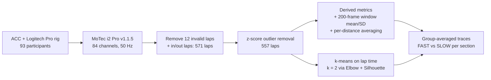

# Hojaji2024_DrivingBehaviour — An AI Approach for Analyzing Driving Behaviour in Simulated Racing Using Telemetry Data

**1. Provenance & Objective**
- Citation: F. Hojaji, A. J. Toth, J. M. Joyce, M. J. Campbell (Esports Science Research Laboratory, Lero, University of Limerick). In P. Dondio, M. Rocha, A. Brennan, A. Schönbohm, F. De Rosa, A. Koskinen, F. Bellotti (Eds.), *GALA 2023*, LNCS 14475, pp. 194–203, Springer, 2024. DOI: 10.1007/978-3-031-49065-1_19. `Hojaji2024_DrivingBehaviour.pdf` (venue from the chapter's copyright footer, p. 194 — the sidecar venue field is empty)
- Core Goal: Collect whole-lap telemetry from 93 sim racers in a controlled lab setup, define lap-based behavioural metrics (lane deviation, understeer, oversteer, steering reversal rate, trail braking application, throttle release application), cluster laps by lap time into FAST/SLOW, and compare the averaged traces of the two groups along the lap. (`Abstract`, `Sec. 1` last paragraph)
- **Relation to this thesis:** human drivers, one sim/car/track. Its value is (a) the first corpus paper that overlays track **sections** (S1–S9 straights, T1–T9 turns) on group-averaged telemetry, and (b) a qualitative per-corner observation that FAST/SLOW differences concentrate in the first three corners and almost vanish in the last three (`Sec. 3.2`, `Figs. 2–3`). No per-sector number is ever computed — that is the gap.
- Code/data: not released; not reported in the source.
- Same lab and same sim/track as [[Hojaji2023_TelemetryML]], but a **different data source**: here, lab participants on a lab simulator (`Sec. 2.1`); there, public MoTec servers. Lap counts differ (557 here vs 782 there). The paper does not state whether the datasets overlap. Do not merge their numbers.

**2. Methodology Breakdown**
- Apparatus: Assetto Corsa Competizione (ACC) on "a professional racing simulator"; Logitech Pro wheel and pedals, manual gearbox, clutch. Telemetry routed to MoTec i2 Pro (v1.1.5). Processing in Python 3.9, Anaconda3 (Spyder 5.2). (`Sec. 2.1`)
- Participants: 93. 85 % held a driving licence; mean real driving 10.14 h/week (SD = 10.04); self-reported racing-game play 12.32 h/week (SD = 9.29). Task: "drive as quickly as they could while keeping the car on the track". (`Sec. 2.1`)
- Car: **not reported in the source** ("all participants used the same car and track", `Sec. 2.2`). Track: Brands Hatch (`Table 1` caption; `Sec. 3.2`). Laps per participant: not reported. Session length / practice protocol: not reported.
- Channels: MoTec records up to 84 metrics; time series extracted at **50 Hz**. Three files per participant: lap-time summary, channel statistics, time series. (`Sec. 2.2`)
- Cleaning: 12 invalid laps removed (incl. zero lap time from MoTec disconnection); out laps and in laps excluded → **571 laps**; z-score outlier removal → **557 laps**. The z threshold is not reported. (`Sec. 2.2`)
- Base channels analysed: speed, RPM, steering angle, lateral and longitudinal acceleration, brake pedal position, throttle, as functions of lap distance. (`Sec. 2.2`)
- Derived metrics (definitions as given, `Sec. 2.2`):

| Metric | Definition in the source | Formula given? |
| :--- | :--- | :--- |
| Lane deviation | "difference between the car's lateral position and the centre of the lane" (listed as "based on the steering angle data channel") | No |
| Understeer / Oversteer | Described qualitatively (front grip loss / rear-wheel-drive acceleration or braking in a corner), "based on the steering angle data channel" | No |
| Steering reversal rate | "number of times the driver crossed the centred position of the wheel" | No (not plotted either) |
| Trail braking application | "percentage of the distance between maximum brake and brake release divided by the length of braking zone" | Verbal only; braking-zone detection not described |
| Throttle release application | "distance covered from throttle application to throttle release" | Verbal only |

- Windowing: sliding window of **200 frames at 50 Hz** per channel; mean and standard deviation per window. (`Sec. 2.2`) (200 frames at 50 Hz = 4 s; that conversion is ours, not stated in the source.) Window stride/overlap: not reported.
- Distance normalization: "one row per lap distance indicator by averaging all the data related to that lap distance"; output is 93 CSV files, one per participant. Distance bin size: not reported. (`Sec. 2.2`)
- Clustering: k-means on lap-time performance, $k$ chosen by Elbow method and Silhouette Coefficient → 2 clusters, FAST and SLOW. (`Sec. 3.1`) The feature vector fed to k-means is described only as "based on performance (lap time)" (`Abstract`, `Sec. 4`).
- Section map: section boundaries "obtained from professional drivers", drawn as grey bands in `Figs. 2–3`. Boundary positions in metres: not reported. (`Sec. 3.2`)

*(steps and counts from `Sec. 2.1`, `Sec. 2.2`, `Sec. 3.1`, `Sec. 3.2`. The paper does not state whether windowing ran before or after clustering; the parallel branches reflect that it is unstated.)*

**3. Key Findings & Performance Metrics**

| Cluster | Laps | Mean [s] | Std | Min [s] | Max [s] | Median [s] | Source |
| :--- | :--- | :--- | :--- | :--- | :--- | :--- | :--- |
| SLOW | 115 | 102.86 | 5.09 | 96.47 | 114.61 | 101.16 | `Table 1` |
| FAST | 441 | 89.93 | 2.65 | 85.04 | 96.32 | 89.58 | `Table 1` |

- Clustering "accuracy of 81.42%". What this is measured against is not defined — k-means is unsupervised and no ground-truth labels, split, or metric definition are given. (`Sec. 3.1`)
- Both clusters described as normally distributed "as we observe similar mean and median values" (no normality test reported). (`Sec. 3.1`, `Fig. 1`)
- Group-level trace observations, all qualitative, no statistics (`Sec. 3.2`, `Figs. 2–3`):
  - All groups drive straights the same way and differ in corners.
  - FAST: accelerate earlier and harder after corners, sharper throttle, higher brake, more stable steering; more throttle release application and more trail braking application; brake max and median higher.
  - Braking and longitudinal acceleration change proportionally per group; "no discernible trend" in lateral or longitudinal acceleration.
  - FAST apply more steering angle approaching corners → larger lane-deviation amplitude.
  - FAST laps "experience understeer situations almost twice as often as slow laps" and "far less oversteer". No count or rate is reported behind "almost twice".
- **Per-corner observations (the part closest to this thesis):** differences are largest in the first three corners, "especially T2, which is kind of a hairpin corner that requires threshold braking in a straight line"; at T3 SLOW drivers brake earlier and lift earlier, "ending up with less speed"; in the last three corners there is "a little variation", both groups lift and brake about the same. (`Sec. 3.2`)
- Chart readings (approximate, read from `Fig. 2`): peak brake at the T2 approach ~88 % FAST vs ~65 % SLOW; peak speed on the longest straight (S5) ~230 km/h FAST vs ~170 km/h SLOW; lap-distance axis runs to ~4000 m. These are averaged traces, not per-lap values.
- Conclusion claim: "over the course of the whole lap, a higher value of the speed mean, a longer throttle release application, and a higher lane deviation led to a shorter laptime." (`Sec. 4`) No regression, correlation coefficient, or significance test supports "led to".
- Runtime / hardware for analysis: not reported in the source.

**4. Critique & Optimization Vectors**
- **Autonomous or human?** Human. Output is descriptive (group-averaged traces), not advice to an individual driver. No per-driver gap to the FAST reference is computed. (`Sec. 3.2`, `Sec. 4`)
- **Granularity: sections drawn, never measured.** The sectors S1–S9 / T1–T9 are only visual bands on a plot; no sector time, no per-sector metric, no per-sector test. "The beginning part of the track has the most differences" is an eyeball judgement. This is exactly the thesis gap: quantify per-sector feature importance and time loss on the same kind of data. (`Sec. 3.2`, `Figs. 2–3`)
- **Corner interdependency observed, not measured.** The T2 → T3 narrative (earlier braking at T3 costs speed, `Sec. 3.2`) hints at carry-over between consecutive corners, but no analysis links exit of one corner to the next.
- **Clustering is effectively a 1-D lap-time threshold.** SLOW min 96.47 s and FAST max 96.32 s do not overlap (`Table 1`), so the two clusters split lap time at ~96.4 s. Calling FAST laps "an elite racer's lap time" (`Sec. 3.1`) confuses lap class with driver class — laps are pooled, and one driver can contribute to both clusters. Driver-level labels are not reported.
- **Undefined "accuracy" of 81.42 %.** No reference labels, no split, no cross-validation, no metric definition. Treat as unverifiable. (`Sec. 3.1`)
- **Count inconsistency.** 557 laps after cleaning (`Sec. 2.2`) but 115 + 441 = 556 in `Table 1`. One lap is unaccounted for; the paper does not explain.
- **Class imbalance** 441 FAST vs 115 SLOW is not addressed. (`Table 1`)
- **Averaging may create the signal.** Traces are averaged per distance across all laps in a group (`Sec. 2.2`, `Sec. 3.2`). SLOW throttle never reaches 100 % in `Fig. 2`, which is consistent with averaging laps whose throttle points differ in position (our inference, not tested in the source). No variance bands are shown.
- **No statistics at all.** No hypothesis tests, effect sizes, or confidence intervals for any FAST/SLOW difference. "Almost twice as often" understeer has no count behind it. (`Sec. 3.2`)
- **Metric definitions are not reproducible.** Understeer/oversteer have no formula; lane deviation needs a lane centre whose source is not given; steering reversal rate is defined but never reported; braking-zone detection for trail braking is not described. (`Sec. 2.2`)
- **Parameters tuned but never swept:** window length 200 frames, z-score threshold (not reported), $k = 2$ (only the result of Elbow/Silhouette is given, not the curves), distance-bin size (not reported). (`Sec. 2.2`, `Sec. 3.1`)
- **What scales badly:** one sim (ACC), one track (Brands Hatch), one unnamed car, one input device (Logitech Pro). (`Sec. 2.1`, `Table 1`)
- **Author-admitted gaps** (quoted exactly, `Sec. 4`): "Our work opens future research directions, including analyzing driving behaviours on various types of tracks and utilising the model to identify the channels that are more challenging to professional racers. Furthermore, time-series telemetry data can be used to forecast several features such as the lap time."
- **Proprietary tooling.** MoTec i2 Pro does the channel extraction (`Sec. 2.1`); whether lane deviation or understeer/oversteer are MoTec math channels or the authors' own code is not stated.
- **Zero computational profiling.** No hardware, no runtime for any step. Nothing here enters a timing comparison. (whole paper; not reported in the source)
