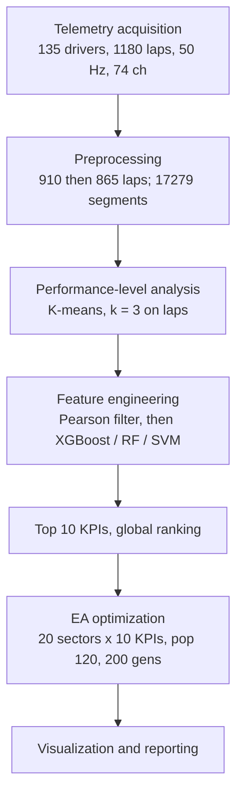
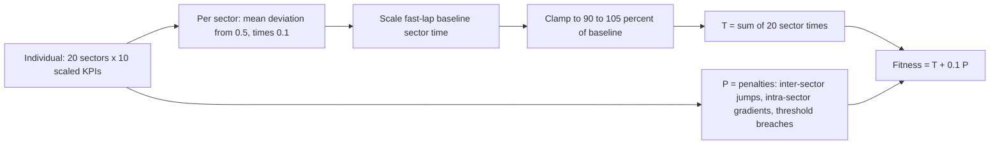

# Hojaji2026_TelemetryEA — Optimizing Sim Racing Performance Using Machine Learning and Evolutionary Algorithms

**1. Provenance & Objective**
- Citation: F. Hojaji, A. Toth, M. Campbell, *Special Session on eSports Performance, Artificial Intelligence and Knowledge in Esports - Trends & Applications* (SPIKE 2026), in *Proc. 18th Int. Conf. on Agents and Artificial Intelligence (ICAART 2026)*, Vol. 1, pp. 997–1004, 2026. DOI: 10.5220/0014609600004052. `Hojaji2026_TelemetryEA.pdf` (Zotero key `JG5X7AYR`; proceedings volume and pages from the PDF footer, p. 997)
- Core Goal: Join ML feature importance and an evolutionary algorithm (EA) in one pipeline, driven by real human telemetry. It has three aims: "(1) identify telemetry features most predictive of lap performance; (2) use these features to guide EA optimization of sector-level driving behaviour; and (3) quantify which behavioural metrics provide the largest performance gains, supporting practical coaching recommendations." (`Sec. 1`)
- Lineage: "adopts the same analytical framework established in our prior work (Hojaji et al, 2024)" (`Sec. 3`). The 2024 paper is *Computers in Human Behavior Reports* 14, 100414 (`References`). The 2024 paper is not yet ingested. The 2023 paper is ingested as [[Hojaji2023_TelemetryML]]. The KPI definitions are deferred to the 2024 paper (`Sec. 4.1`).
- Code/data: not released. The paper states only that "the implementation strictly follows the code structure developed for this project" (`Sec. 3.5`).

**2. Methodology Breakdown**

*Data*
| Item | Value | Source |
| :--- | :--- | :--- |
| Event | Gamescom 2024, Cologne | `Sec. 3.1` |
| Simulator / version | Assetto Corsa Competizione v1.9 | `Sec. 3.1` |
| Car / circuit | McLaren 720S GT3 / Laguna Seca, identical setup, fixed track conditions | `Sec. 3.1` |
| Rig | Playseat Sensation Pro, Logitech Pro wheelbase + pedals, 32-inch monitor | `Sec. 3.1` |
| Logger | MoTeC i2 Pro, 50 Hz, 74 channels | `Sec. 3.1` |
| Participants / raw laps | 135 / 1,180 | `Sec. 3.1` |
| After removing zero-time laps, in-laps, out-laps, and corrupt laps | 910 laps | `Sec. 3.2` |
| After Z-score outlier removal (\|z\| > 3) | 865 laps (lap dataset); 17,279 segment entries (segment dataset) | `Sec. 3.2` |
| Laps per driver | not reported (pooled across drivers) | — |
| Tooling | Python 3.9, Scikit-learn | `Sec. 3.2` |

- 17,279 / 865 ≈ 19.98 segments per lap. This matches the 20-sector chromosome (`Sec. 3.5.1`). *(Our arithmetic. The paper does not state the segmentation rule.)*

*Performance levels*: K-means on the lap dataset, with k chosen by the Elbow method and the Silhouette coefficient. The result is 3 clusters (fast / medium / slow) with mean lap times of 86.4 s / 91.2 s / 96.8 s (`Sec. 3.3`). For the segment dataset, clustering uses lap time and segment time together. The number of segment clusters is not reported (`Sec. 3.3`). Cluster sizes (class balance) are not reported.

*Feature selection* (`Sec. 3.4`):
1. 70 % train / 30 % validation split on the **segment** dataset. "all performance estimates stabilized through 10-fold cross-validation."
2. Pearson correlation filter drops weakly related features. The threshold is not reported.
3. XGBoost, Random Forest, and SVM classifiers are tuned by grid search with 10-fold CV.
4. XGBoost is best: Accuracy = 0.87, F1 = 0.85, AUC = 0.90, MAE = 0.42 s. The scores for RF and SVM are not reported.
5. The XGBoost importance ranking gives the top 10 KPIs.

*EA* (`Sec. 3.5`):
- **Chromosome**: 20 sectors (10 corner-dominant, 10 straight-dominant) × 10 min–max-scaled KPIs = C = [speed, absolute lateral acceleration, steering reversal rate per lap, lane deviation, absolute steering angle, oversteer, absolute longitudinal acceleration, steering duration, trail braking duration, brake] (`Sec. 3.5.1`). Length = sectors × features (`Sec. 3.5.3`), i.e. 200 genes *(our arithmetic)*. Genes are initialised in the min–max ranges from the full lap dataset (`Sec. 3.5.1`).
- **Baseline**: the segment dataset is filtered to fast laps only. The mean lap time and mean KPI values are computed over those laps (`Sec. 3.5.1`).
- **Fitness** (`Sec. 3.5.2`): a hand-set linear surrogate. **It is not the trained XGBoost model.** For each sector, the mean deviation of the KPI vector from the midpoint 0.5 is multiplied by 0.1. This value then scales the baseline sector time. The result is clamped to [90 %, 105 %] of the baseline sector time. $T$ = sum of the sector times.
  $$\text{Fitness} = T + \lambda \cdot P,\quad \lambda = 0.1$$
  $P$ aggregates penalties for sudden KPI transitions between consecutive sectors, for large gradients within a sector, and for values above "predefined physical thresholds derived from expert knowledge and telemetry constraints". The penalty functional forms and thresholds are not reported (`Sec. 3.5.2`).
- **Operators** (`Sec. 3.5.3`): population 120, 200 generations, tournament size 3, two-point crossover p = 0.8, Gaussian mutation rate 0.15 with σ = 0.05, elitism of the 2 best per generation.

*(Six stages from `Fig. 1`. Counts from `Sec. 3.1–3.5`.)*

*(From `Sec. 3.5.2`. The paper does not state the sign convention, i.e. which direction of deviation from 0.5 shortens the time, or how P is aggregated. The paper also does not state the order in which the EA operators are applied, so no generation loop is drawn.)*

**3. Key Findings & Performance Metrics**

*Feature importance* (`Fig. 2`, all values read from chart, normalised importance score):
| Rank | KPI | ~Score |
| :--- | :--- | :--- |
| 1 | speed | ~1.0 |
| 2 | absolute lateral acceleration | ~0.96 |
| 3 | steering reversal rate per lap | ~0.65 |
| 4 | absolute longitudinal acceleration | ~0.5 |
| 5 | steering duration | ~0.42 |
| 6–8 | lane deviation, absolute steering angle, brake | ~0.33 each |
| 9 | oversteer | ~0.25 |
| 10 | trail braking duration | ~0.24 |

The text lists "speed, trail-braking duration, steering angle, oversteer, and lane deviation as the most influential metrics" (`Sec. 4.1`, `Abstract`). This does not match the `Fig. 2` ordering. See Critique.

*EA convergence* (`Sec. 4.2`, `Fig. 3`). **All lap times are surrogate predictions, not driven laps.**
| Quantity | Value | Source |
| :--- | :--- | :--- |
| Starting baseline ("average human baseline lap time") | 91.05 s | `Sec. 4.2` |
| Human minimum lap | 86 s | `Sec. 4.2` |
| Drop in generations 0–50 | "approximately 4-5 seconds" | `Sec. 4.2` |
| Refinement in generations 60–180 | "approximately 0.1-0.2 seconds per 10 generations" | `Sec. 4.2` |
| Best EA lap | "approximately 81-82 s" | `Sec. 4.2` |
| Gain vs average human / fastest human | "nearly 9-10 seconds" / "around 4-5 seconds" | `Sec. 4.2` |
| Chart reference lines | Human Baseline ~89 s, Min Human Lap ~84.7 s; best curve starts ~89.7 s and ends ~81.3 s (read from chart) | `Fig. 3` |
| Runs / seeds / variance | not reported (one curve shown) | — |
| Wall-clock time and hardware of the EA | not reported | — |

*EA lap vs human best lap* (`Table 1`, "per-lap average KPI values". Units are not reported. The human best lap's lap time is not reported.)
| KPI | Human best | EA | Ratio EA/Human |
| :--- | :--- | :--- | :--- |
| speed | 146.28 | 162.00 | 1.11 |
| absolute lateral acceleration | 0.72 | 0.88 | 1.22 |
| steering reversal rate per lap | 14.15 | 10.00 | 0.71 |
| lane deviation | 0.24 | 0.12 | 0.50 |
| absolute steering angle | 28.98 | 22.00 | 0.76 |
| oversteer | 0.04 | 0.02 | 0.50 |
| absolute longitudinal acceleration | 0.42 | 0.68 | 1.62 |
| steering duration | 601.67 | 520.00 | 0.86 |
| trail braking duration | 18.28 | 32.00 | 1.75 |
| brake | 10.27 | 9.50 | 0.93 |

- The authors conclude that lane deviation, oversteer, trail braking duration, and absolute longitudinal acceleration "benefited most from EA optimization" (`Sec. 5`, `Abstract`).

**4. Critique & Optimization Vectors**
- **Autonomous or human? A synthetic KPI vector that no one drove.** The "idealized lap" is a 20 × 10 array of KPI averages scored by a hand-set surrogate. It is never driven in ACC, never replayed, and never converted to a trajectory or control inputs. The paper claims "actionable insights" (`Abstract`), but no driver is shown to reach the EA values. The authors call the link to "human- drivable control strategies" "underexplored" (`Sec. 1`), and this paper does not close that gap. Vector for this thesis: validate EA-proposed sector targets against held-out human telemetry, or in a simulator.
- **Global feature importance: the admitted gap.** Quote: *"feature importance in this study was computed globally rather than at the individual sector level. While sector-specific feature importance could potentially provide more localized coaching insights, reliable estimation would require larger datasets for each segment to ensure statistical stability. Future work could therefore explore segment-level models to refine corner-specific performance recommendations"* (`Sec. 5`). The same 10 weights apply to all 20 sectors. This is the direct opening for sector-level importance.
- **No corner interdependency in the model.** $T$ is a sum of independent per-sector terms (`Sec. 3.5.2`). The only coupling between sectors is a smoothness penalty on "sudden KPI transitions between consecutive sectors", and its form is not reported. Exit speed from corner *i* does not change the time of sector *i+1*. This is the interdependency question the thesis measures.
- **The surrogate is not the learned model.** XGBoost ranks the features (`Sec. 3.4`), but the fitness is a fixed linear rule: mean deviation from 0.5 × 0.1 (`Sec. 3.5.2`). All 10 KPIs enter with equal weight, so the importance scores never set how much each feature is worth in seconds. The sign convention is also not stated. Table 1 shows the "better" direction differs per KPI (speed up, steering reversal down). One "mean deviation from 0.5" cannot express that unless some features are inverted, and the paper does not say. Vector: use a trained per-sector regressor as the fitness.
- **Is the reported optimum the clamp floor?** Sector times are floored at 90 % of baseline (`Sec. 3.5.2`). 0.9 × 91.05 s = 81.945 s *(our arithmetic)*, and the EA "converged to approximately 81-82 s" (`Sec. 4.2`). The headline gain may therefore be the bound, not something the EA discovered. The paper does not discuss this. The constants 0.1 (weight), 0.9/1.05 (bounds), and λ = 0.1 each have one value and are **never swept**.
- **Baseline inconsistency.** The baseline is "derived from fast human laps" (`Sec. 3.5.1–3.5.2`), but the start value is "an average human baseline lap time of 91.05 s" (`Sec. 4.2`). 91.05 s is near the **medium** cluster mean of 91.2 s, not the fast cluster mean of 86.4 s (`Sec. 3.3`). "Human minimum lap time of 86 s" (`Sec. 4.2`) is close to the fast cluster *mean*. `Fig. 3` reference lines read ~89 s and ~84.7 s (read from chart), which match neither text value.
- **Text and figure disagree on the top KPIs.** The text puts trail-braking duration, oversteer, and steering angle in the top five (`Sec. 4.1`, `Abstract`). In `Fig. 2` they rank 10th, 9th, and 6–8th (read from chart). Absolute lateral acceleration (2nd in `Fig. 2`) is absent from the text's list.
- **Text understates Table 1.** The text says lane deviation and oversteer show "minor reductions" and trail braking "increased slightly" (`Sec. 4.3`). Table 1 gives ratios of 0.50, 0.50, and 1.75. The EA-lap values are also suspiciously round (162.00, 10.00, 22.00, 32.00, 520.00; `Table 1`). The paper does not explain how scaled genes are mapped back to these units.
- **Weak evaluation of the classifier.** One 70/30 split plus 10-fold CV. Class count and class balance are not reported, the target label is not defined (segment cluster?), and there is no per-class metric (`Sec. 3.4`). "MAE = 0.42 s" is reported for a *classifier*, and the paper does not say how a classification error has units of seconds. No RF/SVM numbers are given, so "XGBoost achieved the highest performance" cannot be checked.
- **Unquantified claim.** Feature selection "contributed to faster convergence and more stable optimization compared to exploratory optimisation using all available telemetry variables" (`Sec. 5`). No all-feature EA run is reported anywhere. There is no ablation.
- **Convergence hedge.** "Beyond around 200 generations, the optimisation stabilised" (`Sec. 4.2`), but the run stops at 200 generations (`Sec. 3.5.3`). There is a single run with no seeds or spread, and EA runtime and hardware are not reported (`Sec. 3.5.3`, `Sec. 4.2`).
- **Segmentation not specified.** The 20 sectors are split "10 corner-dominant and 10 straight-dominant" (`Sec. 3.5.1`). The boundary rule (distance, curvature, fixed markers) is not given. It is needed to reproduce the segments or compare against them.
- **Scales badly: one sim, one car, one track.** ACC v1.9, McLaren 720S GT3, Laguna Seca (`Sec. 3.1`). The authors admit it: *"The dataset is limited to one circuit and one car configuration, which may restrict generalizability"*. The model excludes tyre degradation, fuel load, and environment. The work is offline only (`Sec. 6`). They also state that "retraining of the ML models and re-optimization of the EA would be required for each new circuit" (`Sec. 5`).
- **Pooled drivers, show-floor setting.** 135 public participants at Gamescom (`Sec. 3.1`). Laps per driver and skill spread are not reported. The "human best lap" in Table 1 is one lap from an unknown driver.
