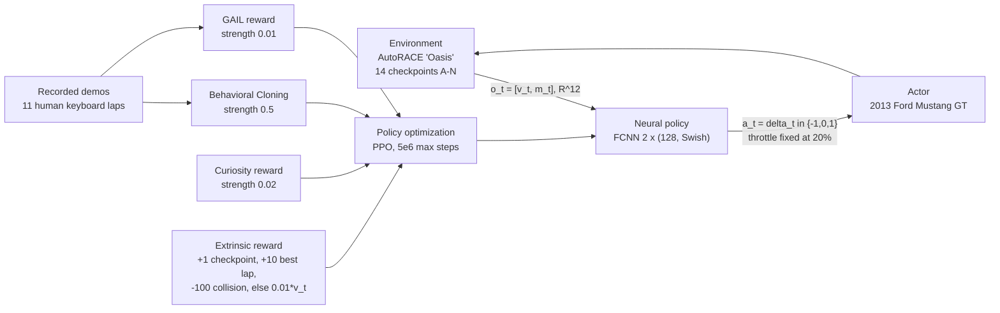
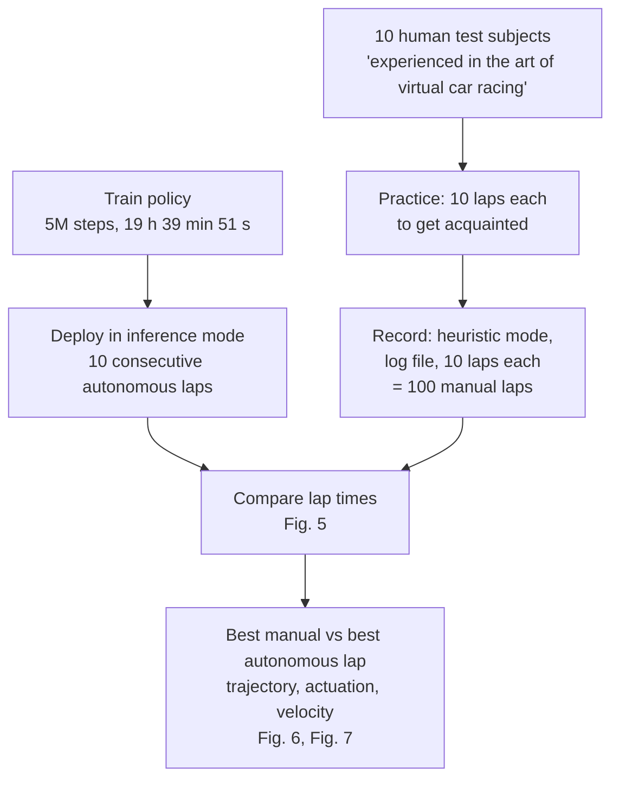

# Samak2021_HybridImitationRL — Autonomous Racing using a Hybrid Imitation-Reinforcement Learning Architecture

**1. Provenance & Objective**

- Citation: Chinmay Vilas Samak\*, Tanmay Vilas Samak\*, Sivanathan Kandhasamy (Autonomous Systems Lab, Department of Mechatronics Engineering, SRM Institute of Science and Technology, Kattankulathur 603203, Tamil Nadu, India). *ArXiv* abs/2110.05437 (cs.RO). DOI: 10.48550/arxiv.2110.05437. Publication year **2021**. (\* "These two authors contributed equally to this research work", p. 1 footnote.) Source file `2110.05437v2.pdf`.
- **Version discrepancy (flag).** The bibliography entry gives 2021 (arXiv v1, identifier `2110.05437`). The file in this vault is **v2**, whose arXiv side-stamp reads `arXiv:2110.05437v2 [cs.RO] 26 Nov 2022` (p. 1, left margin). The citation year stays 2021 (first posting / reference ground truth); every location cite in this note refers to the **v2** text. No venue other than arXiv is printed on the paper; it is a preprint, not a proceedings paper (whole document — peer-review venue not reported in the source).
- Core Goal: an **end-to-end control strategy for autonomous vehicles aimed at minimizing lap times in a time attack racing event**, trained with a hybrid imitation-reinforcement learning architecture, plus the release of *AutoRACE Simulator* as the training/benchmarking environment. (`Abstract`; `Sec. I`, paras. 3–4)
- Headline claim: the agent learned to drive (imitation) and race (reinforcement) "autonomously in less than 20 hours", and beat the best manual lap by 0.96 s and the human mean lap by 1.46 s over 10 autonomous laps vs 100 manual laps by 10 human players. (`Abstract`)
- Code/data: simulator source released — `https://github.com/Tinker-Twins/AutoRACE-Simulator` (`Sec. III-A`, footnote 1). A video of the deployment run is linked at `Sec. IV-B`, footnote 2. The **telemetry logs of the 100 human laps are not released and no dataset link is given** (not reported in the source).
- **Relation to this thesis (GOAL v0.2):** this is a **Related Literature** item, not a method to extend. It is direct evidence for the base document's claim (GOAL §0) that racing optimization is framed as *autonomous control*: the entire optimization target is a neural-network policy, and the 10 human players exist only as a **benchmark to beat**, never as subjects to be improved. It is the strongest single example in the corpus of "limited insight for improving human performance" — see §4 below for the itemized answers. It also touches this thesis' G4 ("validate against human baseline telemetry") from the opposite direction: the authors *did* collect a 100-lap human baseline with lap times, trajectories, actuation traces and velocity profiles, and then used it only for a superiority claim (`Sec. IV-B`, `Fig. 5`–`Fig. 7`).

---

**2. Methodology Breakdown**

**2.1 Simulation system — AutoRACE**

| Item | Value | Source |
| :--- | :--- | :--- |
| Engine | Unity game engine, HDRP rendering, NVIDIA PhysX backend, ML-Agents Toolkit integration | `Sec. III-A` |
| Environment | "Oasis", 500 × 500 m, with racetrack and roadside barriers | `Fig. 2` caption |
| Vehicle | Simulated "Need for Speed" 2013 Ford Mustang GT; throttle, brake, handbrake, steering; 6-speed automatic transmission | `Fig. 2` caption; `Sec. III-A` |
| Track topology | 3 large curves (ABC, DEF, GHI), 2 short deviations (CDE, EFG), 5 straights (NA, CD, GH, IJK, LM), 4 sharp turns (JKL, KLM, LMN, MNA), 1 overpass (EFG), 1 underpass (IJK) | `Sec. III-A` |
| Track segmentation | **14 virtual checkpoints A–N**; checkpoint N is the finish line | `Fig. 2`; `Sec. III-A` |
| Track length | "kept short so as to conform with the FIA standards of measuring its length in terms of laps instead of the actual driving distance" — **numeric length not reported in the source** | `Sec. III-A` |
| Human-driving support | Heuristic controller overrides the autonomous agent; TPV and FPV cameras; HUD; automated data logging | `Sec. III-A` |

**2.2 Learning architecture**

Observation and action spaces (`Sec. III-B`, Eqs. 1–2):

$$o_t = [v_t, m_t] \in \mathbb{R}^{12}, \qquad m_t = [{}^1m_t, {}^2m_t, \cdots, {}^{11}m_t] \in \mathbb{R}^{11}, \qquad a_t = \delta_t \in \mathbb{R}^1$$

- $v_t$ = forward velocity; $m_t$ = 11 frontal range readings up to **50 m**, spread **90° each side** of the heading vector, **18° apart**. (`Sec. III-B`)
- $\delta_t \in \{-1, 0, 1\}$ — discrete left / straight / right steering. Throttle $\tau_t$ is **fixed at 20 % of its upper saturation limit**; the agent never controls throttle or brake. (`Sec. III-B`)
- Demonstration dataset for imitation: **a human drove 11 laps on a standard keyboard**; the authors call these demonstrations "sub-optimal in terms of trajectory optimization and were solely intended to impart fundamental driving ability". (`Sec. III-B`)

Four training signals (`Sec. III-B`):

1. **Behavioral Cloning** — supervised update against the recorded demonstrations, applied "every once in a while, mutually exclusive of the reinforcement learning update".
2. **GAIL reward** ${}^g r_t$ — rewards closeness of new observation-action pairs to the demonstrations.
3. **Curiosity reward** ${}^c r_t$ — rewards the difference between predicted and actual encoded observations.
4. **Extrinsic reward** ${}^e r_t$, optimized with **PPO**:

$$
{}^e r_{T_t} = \begin{cases}
r_{collision} = -100 & \text{if collided} \\
r_{checkpoint} = +1 & \text{if passed checkpoint} \\
r_{best\,lap} = +10 & \text{if recorded best lap time} \\
0.01 * v_t & \text{otherwise}
\end{cases}
$$

(`Sec. III-B`, Eq. 3; numeric values stated in the same paragraph.)

Training configuration (`Table I`, verbatim): FCNN $2 \times (128,\ \text{Swish})$; batch size 64; buffer size 1024; learning rate $\alpha = 3\text{e-}4$, linear schedule; entropy regularization $\beta = 0.01$; policy update $\epsilon = 0.2$; regularization $\lambda = 0.97$; epochs 3; maximum steps 5e6. BC strength 0.5. GAIL: ${}^g\gamma = 0.99$, strength 0.01, encoding size 128, ${}^g\alpha = 3\text{e-}4$. Curiosity: ${}^c\gamma = 0.99$, strength 0.02, encoding size 256, ${}^c\alpha = 3\text{e-}4$. Extrinsic: ${}^e\gamma = 0.99$, strength 1.0.

*(architecture from `Fig. 3` and `Sec. III-B`; all numeric values from `Table I` and `Sec. III-B` Eq. 3)*

**2.3 Experimental protocol — autonomous vs human**

*(protocol from `Sec. III-C` and `Sec. IV-C`; timing from `Sec. IV-C`)*

Fairness controls the authors imposed so "the playing field was to be leveled" (`Sec. III-C`): **similar approach** (both entities map real-time observations directly to control actions); **equivalent observations** (agent gets velocity + ranging; humans estimate pose and velocity from visual feedback, free to pick TPV or FPV and to view the HUD); **appropriate actions** (constant throttle for both; because the humans used a standard computer keyboard, the agent's action domain was also made discrete).

---

**3. Key Findings & Performance Metrics**

**3.1 Lap-time comparison (10 autonomous laps vs 100 manual laps, 10 players)**

| Quantity | Value | Source |
| :--- | :--- | :--- |
| Mean lap time, autonomous agent | 63.148 s | `Fig. 5` caption |
| Mean lap time, human players | 64.62 s | `Fig. 5` caption |
| Best lap, autonomous agent | 62.58 s | `Fig. 5` caption |
| Best lap, human players | 63.54 s | `Fig. 5` caption |
| Mean advantage of agent | 1.46 s | `Abstract`; `Sec. IV-B` |
| Advantage over the best human lap | 0.96 s | `Abstract`; `Sec. IV-B` |
| Laps in which the agent outperformed all humans | 9 out of 10 | `Sec. IV-B` |
| Mean forward velocity, autonomous lap | 77.74 km/h | `Sec. IV-B`; `Fig. 7` caption (77.7389 km/h on the plot) |
| Mean forward velocity, best manual lap | 75.83 km/h | `Sec. IV-B`; `Fig. 7` caption (75.8271 km/h on the plot) |
| Per-player statistics (P01–P10) | shown as box plots only; **per-player numeric means/spreads not reported in the source** | `Fig. 5` |

**3.2 Training dynamics** (all from `Sec. IV-A`, `Fig. 4`; 5 million steps)

| Phase | Observation | Source |
| :--- | :--- | :--- |
| until ≈ 0.5M steps | Crashed into barriers at the first curve (ABC); episode length ≤ 4,000 decision steps | `Sec. IV-A` |
| ≈ 0.5M steps | BC loss reduced over 60 %; GAIL reward up to 40 points; curiosity reward near zero; extrinsic reward closing on the 4,000 mark | `Sec. IV-A` |
| next ≈ 0.5M steps | Sharp left-right turn (JKL–KLM) after the IJK straight: curiosity reward rose, policy entropy stagnated at 0.22 | `Sec. IV-A` |
| ≈ 1.5M steps | First complete lap; curiosity back to zero, extrinsic reward over 7,000 | `Sec. IV-A` |
| 2.5M–4.5M steps | Reinforcement-learning exploitation near global optimum | `Sec. IV-A` |
| 4.5M–5.0M steps | Settled: max GAIL reward nearly 100, extrinsic reward over 8,000, policy entropy 0.16; BC loss "almost converged to its minima (≈ 0.6)" | `Sec. IV-A` |

**3.3 Computational cost** (`Sec. IV-C`)

| Item | Value |
| :--- | :--- |
| Hardware | Intel i7-8750H CPU, NVIDIA RTX 2070 GPU, 16 GB RAM (one personal laptop) |
| Software stack | Unity 2018.4.24f1; ML-Agents 0.19.0; Python 3.7.9; TensorFlow 2.3.0 |
| Compute used for learning | "neural network training and inference phases were both carried out on the CPU alone"; the GPU served the simulator frontend |
| Training time | **19 hours 39 minutes 51 seconds** for 5 million steps, single agent |
| Measurement condition | simulator and training/deployment scripts ran **in parallel on the single laptop** |
| Mean deployment latency | **3.42 ms** per observation-action cycle |
| Full simulation step | ~**9.61 ms** on average (includes rendering, scripts, physics, transformations, illumination, UI) |
| Baseline compared against | Fuchs et al. `[21]`: "over 72 hours of training time with four PlayStation 4 consoles simulating 20 cars each and a dedicated workstation training the neural network policy on its GPU" |

**3.4 Qualitative segment-level findings** (`Sec. IV-B`, `Fig. 6`, `Fig. 7`)

- The best manual and best autonomous laps followed similar paths "except at sections **CDE** and **IJK**".
- At CDE the *human* was slightly ahead: "the human player slightly dominated the autonomous agent, and even performed a clean out-in-out maneuver at section CDE where the autonomous agent preferred a slightly curved path respecting the roadside barriers."
- At IJK the agent took "a significant lead"; the best human racer's line there "although the trajectory was collision-free, it was clearly sub-optimal", while the agent "executed an excellent out-in-out maneuver (which is nearly unachievable by humans)".
- Strategy attributed to the agent: frequent steering switching to avoid continuous drifting and align wheels with the velocity vector, at a control frequency humans cannot match ("the time difference in action switching was significantly high", `Fig. 7`).
- Cross-over point: "after section CDE (i.e., after ≈ 4,200 time steps w.r.t. `Fig. 7`)" the agent's instantaneous velocity was "almost always higher" than the manual lap's.
- The authors themselves bound the generality of this: "these results are obtained from one sample experiment and that the human player as well as the autonomous agent are extremely likely to follow a slightly different racing strategy in subsequent experiments". (`Sec. IV-B`)

---

**4. Critique & Optimization Vectors**

**4.1 Direct answers to the thesis' framing questions**

- **Subject: autonomous agent or human driver?** An **autonomous agent**. The whole optimization loop (BC + GAIL + curiosity + PPO) trains a neural-network policy; no human model, no driver feedback, no coaching objective anywhere in the paper. Humans enter only at two points: as the source of 11 sub-optimal demonstration laps (`Sec. III-B`) and as the 10-player benchmark to be beaten (`Sec. III-C`). The stated purpose of beating them is to "develop realistic non-player characters (NPCs) that compete with human players" (`Sec. I`, last para.) — the human is the opponent, not the client.
- **What exactly was measured on the humans?** 10 test subjects, "experienced in the art of virtual car racing", each drove **10 practice laps** to get acquainted, then **10 recorded laps** in the simulator's heuristic (manual) mode, producing a log file — **100 manual laps total** (`Sec. III-C`). The recorded/reported channels are: **lap time** per lap (`Fig. 5`, box plot per player P01–P10); for the single best manual lap, **vehicle position over time with instantaneous forward velocity as a colour gradient** (`Fig. 6a`), **actuation command trace** and **velocity profile vs time step** with checkpoint bands A–N overlaid (`Fig. 7a`), and **mean forward velocity 75.83 km/h** (`Fig. 7` caption). Input device: **standard computer keyboard** (`Sec. III-C`). Camera view (TPV/FPV) and HUD use were left to each player and **not recorded** (`Sec. III-C`; not reported in the source). No driver identity, demographics, experience level, age, skill rating, car setup variation, or per-player summary numbers are reported (not reported in the source). No statistical test of the 1.46 s gap is reported (not reported in the source).
- **Is the output interpretable as advice a human driver could act on?** **Essentially no.** The deliverable is network weights $\theta$ mapping $o_t \mapsto \delta_t$ (`Sec. III-B`, Eq. 2) — no feature importance, no ranked driver actions, no per-sector time loss. The only human-readable output is the prose comparison of two laps in `Sec. IV-B` (out-in-out at IJK, avoid continuous drifting, higher switching frequency), which is an *observation about one lap*, not a quantified recommendation. Worse, the paper explicitly places the agent's advantage partly outside human reach: the IJK maneuver is "nearly unachievable by humans", and the agent wins "partly by its higher control frequency" (`Sec. IV-B`; `Sec. V`). Advice that the recipient cannot execute is not coaching. Add that the agent never controlled throttle or brake (fixed 20 % throttle, `Sec. III-B`), so it has nothing to say about the braking and throttle-application behaviour that [[Hojaji2023_TelemetryML]] found separates fast from slow humans (`Sec. 3.3` there).
- **Does it segment the track?** **Yes, but coarsely and for reward shaping, not for analysis.** **14 virtual checkpoints A–N** (`Fig. 2`; `Sec. III-A`) exist to "guide the autonomous agent to progress through the lap by providing appropriate incentive upon passing each checkpoint" — i.e. $r_{checkpoint} = +1$ (`Sec. III-B`, Eq. 3). Named multi-checkpoint sections are used descriptively (ABC, CDE, DEF, EFG, GHI, IJK, JKL, KLM, LMN, MNA — `Sec. III-A`), and the checkpoint bands are drawn over the traces in `Fig. 7`. But **no per-sector time is reported for any lap, human or autonomous** (not reported in the source). Granularity is ~14 segments over a track whose length is not reported, so a metres-per-sector figure cannot be computed.
- **Corner interdependency / speed trade-off between sequential corners?** **Only qualitatively, never quantified.** Two statements approach it: (i) "the vehicle had attained high velocity owing to the prior straight drive (IJK), and the agent had to take a sharp left-right turn (JKL-KLM) using steering control alone" — an explicit entry-speed-to-next-corner coupling, reported as a training difficulty, not measured (`Sec. IV-A`); (ii) the cross-over "after section CDE (i.e., after ≈ 4,200 time steps w.r.t. `Fig. 7`)" after which the agent's velocity stayed higher (`Sec. IV-B`). Neither is an effect size, a correlation, or an ablation. **This is exactly the vacancy G2.2 aims at** — the coupling between sector $i$ and $i+1$ is here visible to the naked eye and left unmeasured.
- **Data scale, training time, hardware.** Scale: 11 demonstration laps; 5e6 training steps; 10 autonomous evaluation laps; 100 human laps from 10 players; 1 track, 1 vehicle, 1 agent. Training: **19 h 39 min 51 s** on **Intel i7-8750H CPU + RTX 2070 GPU + 16 GB RAM**, training/inference on **CPU only**, with the simulator running concurrently on the same laptop (`Sec. IV-C`). Inference: 3.42 ms per observation-action cycle; 9.61 ms per full simulation step (`Sec. IV-C`). **Number of training seeds / repeats: 1 (not reported as more than one; no variance on the training curves) — not reported in the source.**

**4.2 Blind spots (AGENTS.md §4 checklist)**

- **Simulation only.** Everything is inside AutoRACE/Unity; no hardware run. The authors name this themselves as future work: "this work can be taken up to transfer the racing behavior models trained in simulated scenarios to real-world autonomous racecars, with little or no modification" (`Sec. V`) — the "little or no modification" is an unevidenced hedge. Sim2real is repeatedly stated as a *design intent*, never demonstrated (`Sec. II-B`: "in order to enable *sim2real* transferability in the future").
- **n = 1 experiment, admitted.** The lap-time claim rests on one deployment session, and the authors concede "these results are obtained from one sample experiment" and that both racers "are extremely likely to follow a slightly different racing strategy in subsequent experiments" (`Sec. IV-B`). No repeats, no seeds, no confidence interval on the 1.46 s / 0.96 s margins.
- **Tuned but never swept.** Every entry of `Table I` is a single value: BC strength 0.5, GAIL strength 0.01, curiosity strength 0.02, extrinsic strength 1.0, and the reward magnitudes $\{+1, +10, -100, 0.01 v_t\}$ (`Sec. III-B`, Eq. 3). No sensitivity study of the imitation/reinforcement balance — the very hybrid that is the paper's contribution. The authors list this as future work: "effect of variations in observation and action spaces on the agent's performance can be evaluated exhaustively" (`Sec. V`) — note they name observation/action spaces, not the reward weights, so the reward tuning stays unexamined.
- **What is not timed.** Human lap logging, data extraction, and the trajectory/velocity post-processing behind `Fig. 6`–`Fig. 7` carry no cost figures (not reported in the source). The 19 h 39 min training figure is for **one** agent at **one** hyperparameter setting — the cost of the tuning that produced `Table I` is invisible.
- **Scales badly / one problem size only.** One track, one vehicle, one agent, no opponents. The authors flag it: "This work can be extended to other race forms with distinct rules, vehicle models, environmental settings, agent semantics and actor counts" (`Sec. V`). Nothing in the paper indicates whether 5M steps suffices on a longer or more complex circuit.
- **Reduced action space inflates the comparison.** Throttle is clamped at 20 % and steering is ternary (`Sec. III-B`). The authors present the constant throttle as a *fairness* control (`Sec. III-C`, "Appropriate Actions"), but it also removes the braking-and-throttle dimension in which expert humans are strongest, and the human input device was a keyboard, not a wheel-and-pedal rig. The "10 expert human players" label (`Sec. V`) is not supported by any reported skill measure — `Sec. III-C` says only "experienced in the art of virtual car racing".
- **The paper concedes that the win is partly a latency win, not a driving win.** "This win could be accounted partly by the perfection of the autonomous agent in terms of trajectory optimization and partly by its higher control frequency, which allowed it to minimize unwanted drifting" (`Sec. V`), and "human response time … was quite low as compared to that of the autonomous agent" (`Sec. IV-B`). A superiority claim resting on actuation bandwidth transfers nothing to a human driver.
- **Internal inconsistency to flag.** `Sec. IV-A` states the behavioral cloning loss "had almost converged to its minima (≈ 0.6)", but the y-axis of `Fig. 4(a)` spans roughly 0 to 0.12 (read from chart). The text value and the plotted axis do not agree; the correct converged value cannot be resolved from the paper.
- **Chart-only numbers.** Per-player lap-time distributions in `Fig. 5` and all training-curve values in `Fig. 4` are only plotted; the text quotes a few round figures ("nearly 100", "over 8,000", "0.16") which are the authors' own readings, not tabulated data.
- **Proprietary/closed components.** Unity + PhysX + HDRP are closed-source, and the vehicle is a licensed commercial car model (`Sec. III-A`). The simulator wrapper is open, the physics that produce the lap times are not — so a lap time here is not independently reproducible at the dynamics level. Ironically, `Sec. III-A` criticizes exactly this in Gran Turismo Sport: commercial simulators "are protected by end-user license agreements, which renders them moot for implementing novel approaches or reproducing or validating the results of a prior work".
- **Not metrically comparable to this thesis' line of work.** Lap times here are from a 500 × 500 m fictional "Oasis" circuit in a custom Unity simulator with a fixed-throttle discrete-steering agent; [[Hojaji2023_TelemetryML]] laps are ACC/Brands Hatch human laps. Do not place 63.148 s beside 96.580 s in any table — different simulator, different track, different vehicle, different control authority (AGENTS.md §1).

**4.3 What this thesis takes from it**

1. **Evidence for the literature-position claim** (GOAL §0): a 2021 racing-optimization paper whose optimization variable is a policy network and whose treatment of 10 human drivers stops at "we were 1.46 s faster". Usable verbatim in Chapter 2 as the canonical "autonomous framing, no human insight" case.
2. **A negative template for G4.4 (coaching read-out).** They collected precisely the data this thesis needs — sequential lap logs with position, velocity and actuation per checkpoint band (`Fig. 7`) — and then produced no per-sector time attribution. The gap between "we have the trace" and "we can tell the driver which micro-sector costs time" is the deliverable this thesis is claiming.
3. **A quantified interdependency the authors left on the table.** The IJK-straight → JKL/KLM sharp-turn entry-speed coupling (`Sec. IV-A`) and the CDE cross-over (`Sec. IV-B`) are qualitative statements of exactly the effect G2.2 wants to measure. Cite as prior *observation* of corner interdependency without measurement.
4. **A cost datum for G3.4 comparisons.** 19 h 39 min 51 s / 5M steps / i7-8750H CPU-only is a usable reference point for "what a single-laptop learning-based racing optimization costs", against the 72 h + 4 PS4 consoles + workstation GPU of Fuchs et al. `[21]` (`Sec. IV-C`). It is *not* comparable to an evolutionary lap-optimizer runtime until the same hardware and problem size are stated.
5. **Non-goal reinforcement.** GOAL §3 excludes building an autonomous agent and real-time onboard control. This paper is the shape of the work this thesis is explicitly *not* doing.
